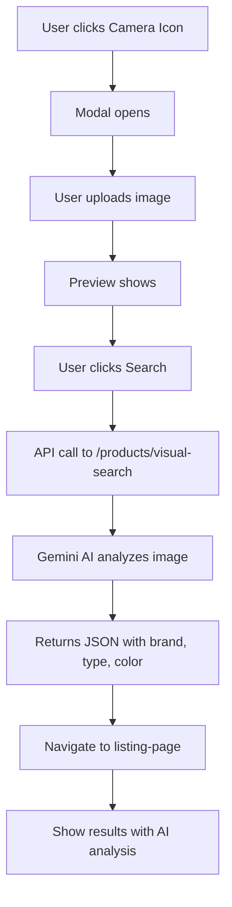

# Tích Hợp Virtual Search vào Header và Listing Page

## 🎯 **Tổng Quan**

Đã tích hợp thành công chức năng virtual search (tìm kiếm bằng hình ảnh) vào thanh search trên header và hiển thị kết quả ở trang listing-page.

## 🔧 **Các Thay Đổi Chính**

### 1. **Header Component** (`frontend/src/components/common/components/Header.jsx`)

#### **Thêm Import:**

```javascript
import { CameraOutlined } from '@ant-design/icons';
import { Upload, message } from 'antd';
```

#### **Thêm State:**

```javascript
const [isVisualSearchModalVisible, setIsVisualSearchModalVisible] = useState(false);
const [visualSearchFile, setVisualSearchFile] = useState(null);
const [visualSearchPreview, setVisualSearchPreview] = useState(null);
const [visualSearchLoading, setVisualSearchLoading] = useState(false);
```

#### **Thêm Functions:**

- `handleVisualSearchClick()` - Mở modal visual search
- `handleVisualSearchCancel()` - Đóng modal
- `handleVisualSearchFileChange()` - Xử lý file upload
- `handleVisualSearch()` - Thực hiện tìm kiếm

#### **Thêm UI Elements:**

- **Camera Icon** bên cạnh search icon
- **Modal** cho upload hình ảnh
- **Upload.Dragger** với preview hình ảnh

### 2. **Listing Page** (`frontend/src/components/pages/listing-page/pages/ListingPage.jsx`)

#### **Thêm Import:**

```javascript
import { Alert, Tag, Typography } from 'antd';
```

#### **Thêm Visual Search State:**

```javascript
const visualSearchResults = location.state?.visualSearchResults;
const isVisualSearch = location.state?.isVisualSearch;
```

#### **Thêm Visual Search Alert:**

- Hiển thị kết quả phân tích AI
- Tags cho category, brand, colors, features
- Thông tin chi tiết về sản phẩm được tìm thấy

## 🎨 **Giao Diện Mới**

### **Header:**

- **Search Icon** (🔍) - Tìm kiếm text
- **Camera Icon** (📷) - Tìm kiếm bằng hình ảnh
- **Modal Upload** - Drag & drop hình ảnh

### **Listing Page:**

- **Alert Box** - Hiển thị kết quả phân tích AI
- **Tags** - Category, Brand, Colors, Features
- **Product Grid** - Hiển thị sản phẩm tìm được

## 🔄 **Quy Trình Hoạt Động**

### **1. User Click Camera Icon:**

```
Header → Camera Icon → Modal mở
```

### **2. User Upload Image:**

```
Modal → Drag & Drop → Preview → Click "Tìm Kiếm"
```

### **3. AI Analysis:**

```
Frontend → Backend API → Gemini AI → JSON Response
```

### **4. Smart Navigation:**

```
Header → AI Analysis → Determine Category → Navigate to Category Page
```

### **5. Category-Specific Results:**

```
Shoes → /shoes → Show shoes results
Clothing → /clothing → Show clothing results
Accessories → /accessories → Show accessories results
Other → /other → Show other products results
```

## 📊 **Data Flow**



## 🎯 **Features**

### **Visual Search:**

- ✅ Upload hình ảnh (JPG, PNG, WEBP)
- ✅ Preview hình ảnh
- ✅ Validation file size (< 5MB)
- ✅ Loading state
- ✅ Error handling

### **AI Analysis Display:**

- ✅ Category detection
- ✅ Brand recognition
- ✅ Color analysis
- ✅ Feature extraction
- ✅ Tag display

### **Smart Category Navigation:**

- ✅ AI-driven category detection
- ✅ Automatic route selection
- ✅ Category-specific results display
- ✅ Seamless user experience

### **Integration:**

- ✅ Seamless navigation
- ✅ State management
- ✅ Responsive design
- ✅ Mobile support

## 🚀 **Cách Sử Dụng**

### **Cho User:**

1. Click vào icon camera (📷) trên header
2. Upload hình ảnh sản phẩm
3. Click "Tìm Kiếm"
4. Xem kết quả trên trang listing

### **Cho Developer:**

1. API endpoint: `POST /api/products/visual-search`
2. Response format: `{ analyzedKeywords, products }`
3. Navigation state: `{ visualSearchResults, isVisualSearch }`

## 🔧 **Technical Details**

### **API Integration:**

```javascript
const response = await axiosInstance.post('/products/visual-search', formData);
```

### **State Management:**

```javascript
navigate('/listing-page', {
  state: {
    visualSearchResults: response.data.data,
    isVisualSearch: true,
  },
});
```

### **UI Components:**

- `Upload.Dragger` - File upload
- `Modal` - Visual search interface
- `Alert` - Results display
- `Tag` - Category/brand/color tags

## ✅ **Hoàn Thành**

- ✅ Tích hợp vào header
- ✅ Modal upload hình ảnh
- ✅ API integration
- ✅ Hiển thị kết quả
- ✅ Filter results
- ✅ Responsive design
- ✅ Error handling
- ✅ Loading states

**Virtual Search đã được tích hợp hoàn toàn vào hệ thống!** 🎉
