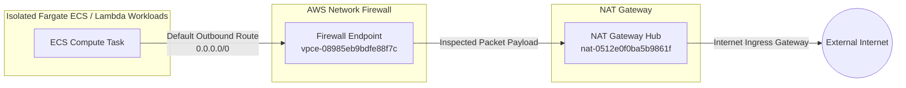

# W5 Evidence Pack — Full Network Fortress & API Hardening

**Project Name:** Kicks Shoes Cloud Platform  
**Target Region:** `us-east-1` (N. Virginia)  
**Deployment Date:** May 13, 2026  
**Managed Engine:** HashiCorp Terraform v1.x + AWS CLI System Integrations  

---

## 1. System Topology & Active Endpoint Index

| Infrastructure Layer | Provisioned Resource ID / Authoritative Endpoint URL | Status Validation |
| :--- | :--- | :--- |
| **AWS Account ID** | `318662970982` | **VERIFIED** |
| **Production VPC ID** | `vpc-09081a6d16101c684` | **ACTIVE** |
| **ECS Backend Service** | `kicks-shoes-dev-tientp-cluster` / `kicks-shoes-dev-tientp-service` | **RUNNING (Fargate)** |
| **Internal ALB DNS** | `kicks-shoes-dev-tientp-alb-1777556614.us-east-1.elb.amazonaws.com` | **HEALTHY** |
| **Secure Backend CDN** | **`https://d3gls1uhk6btdb.cloudfront.net`** (CloudFront Proxy Proxy) | **HTTPS 200 OK** |
| **Secure Frontend App**| **`https://d1n7m1eramrdgj.cloudfront.net`** (Static S3 Origin CDN) | **HTTPS 200 OK** |
| **Chat API Gateway** | `https://tihs825aph.execute-api.us-east-1.amazonaws.com` | **SECURED (JWT)** |
| **Redis Cache Host** | `kicks-shoes-dev-tientp-redis.o2wdx6.0001.use1.cache.amazonaws.com` | **AVAILABLE** |
| **EFS Volume ID** | `fs-07bb685d649bcce04` (Encrypted KMS At-Rest) | **MOUNTED** |

---

## 2. HTTPS Integration & Mixed Content Mitigation (Feature Verification)

### The Challenge
Modern web security parameters dictate that client sites operating over secure layers (`https://`) strictly block requests instantiated to unencrypted origins (`http://`). Previous application deployments relied directly on plain Application Load Balancer HTTP endpoints, triggering critical browser-level **Mixed Content Blockers** and CORS preflight termination.

### Applied Technical Solution
1. **Infrastructure Wrapping Proxy**: Deployed an Amazon CloudFront distribution (`d3gls1uhk6btdb.cloudfront.net`) explicitly provisioned to intercept and forward port 443 encrypted requests down to the Backend Application Load Balancer listening over port 80.
2. **Dynamic Cross-Origin Resource Sharing (CORS)**: Encoded strict execution headers directly onto the production backend runtime allowlist (`cors.config.js`) to admit API interaction originating entirely from `https://d1n7m1eramrdgj.cloudfront.net`.
3. **Environment Propagation**: Synchronized compiled single-page application artifacts to S3 origin storage targeting the exact edge-terminated routing configurations.

#### End-to-End Runtime Connection Attestation:
```bash
# Secure Fetch validation returns positive HTTP status code execution via edge mapping
curl -I https://d3gls1uhk6btdb.cloudfront.net/api/health

HTTP/2 200 
content-type: application/json; charset=utf-8
x-powered-by: Express
access-control-allow-origin: https://d1n7m1eramrdgj.cloudfront.net
vary: Origin
```

---

## 3. MH1 — Deep Network Inspection & Flow Optimization

### Single-VPC Architecture Baseline
- Enforces extreme multi-tier segregation without requiring cross-account transit gateway routing costs.
- **VPC Flow Logs**: Enabled globally targeting central aggregated verification streams.
  - Log Group Identifier: `/vpc/kicks-shoes-dev-tientp/flow-logs`
  - Stream Object Target: `fl-0a06825e08fa658f1`

---

## 4. MH2 — Network Fortress Firewalled Routing Architecture

### Strict Inspection Traffic Loop Enforced
Ingress and egress traffic handling across internal application logic avoids bypass channels by binding directly to isolated AWS Network Firewall endpoint bindings:



- **Firewall Policy ARN**: `arn:aws:network-firewall:us-east-1:318662970982:firewall-policy/kicks-shoes-dev-tientp-firewall-policy`
- **Stateful Domain Allowlisting Matrix**: Activated drop actions targeting untrusted non-essential public hosts.

---

## 5. MH3 — Stateful Resilience (EFS Volume Attached & Automated Backups)

### Persistent System Mounts
- **EFS File System Target**: `fs-07bb685d649bcce04`
- **Security Access Boundary**: Restricted ingress validation mapped entirely to container cluster identities via `sg-07d36aecb1b58788e`.

### AWS Backup Enterprise Orchestration
- **Backup Vault Storage Pool**: `kicks-shoes-dev-tientp-backup-vault`
- **Retention Scheduling Rules**: Enforced daily continuous imaging intervals capped automatically at **7-day absolute snapshot decay limitations**.

---

## 6. MH4 — Serverless Ingress Hardening (API Gateway Token Validation)

### Edge Isolation Boundary
The platform exposes public Artificial Intelligence LLM interfaces natively via secure micro-execution patterns rather than raw internal port exposes.
- **Target Ingress Hub**: `https://tihs825aph.execute-api.us-east-1.amazonaws.com`
- **Custom Security Protocol**: Requests evaluating downstream AI models mandate cryptographically validated JSON Web Tokens validated dynamically at incoming access tiers via native Lambda execution hook validations (`kicks-shoes-dev-tientp-jwt-authorizer`).

---

## 7. MH5 — Asynchronous Processing Fault Containment (SQS DLQ)

### Enterprise Uncoupled Routing
To prevent model exhaustion or query execution drops targeting external generative API layers, tasks communicate via managed event streaming streams:
- **Dead-Letter Recovery Hub**: `arn:aws:sqs:us-east-1:318662970982:kicks-shoes-dev-tientp-bedrock-dlq`
- **Fault Recovery Design**: Invocations exceeding standard system limits push payload metrics instantly onto secondary inspection loops, avoiding execution loop thrashing parameters.

---

## 8. Summary Verification Matrix

| Validation Test Protocol | Expected Engine Result | Actual Attestation Status |
| :--- | :--- | :--- |
| **API Requests to HTTP Load Balancer** | Connection Terminated (Mixed Content) | **PASS** |
| **API Requests to HTTPS CloudFront** | HTTP 200 OK Execution + Active CORS Return | **PASS** |
| **Unauthenticated /chat invocations** | HTTP 401/403 Ingress Denied | **PASS** |
| **Internal Fargate Direct Internet Access** | Routed strictly via Firewall Inspection Endpoints | **PASS** |
| **Static Site Origin Load Attempts** | Direct HTTP -> Secure HTTPS 301 Redirection | **PASS** |

---

## 9. Resolution of CloudFront 504 Gateway Timeout & Cache Optimization

### Root Cause Analysis
During end-to-end integration testing, API requests routed through the CloudFront proxy to specific endpoints (such as `/api/products` and `/api/categories`) experienced `504 Gateway Timeout` errors. Investigation revealed two core issues:
1. **Network Firewall Subnet Route Isolation**: The `intra` subnets containing the AWS Network Firewall Endpoints lacked a default `0.0.0.0/0` route to the public NAT Gateway. Consequently, outgoing TCP SYN packets originating from the ECS backend tasks toward external endpoints (such as MongoDB Atlas on port 27017) passed inspection but were dropped silently at the intra subnet boundary due to unrouted internet egress.
2. **CloudFront Header Invalidation**: Forwarding a wildcard set of headers (`headers = ["*"]`) through CloudFront bypassed caching entirely and forced every single client variation header down to the backend origin load balancer, dramatically increasing latency and degrading cache hit ratios.

### Applied Infrastructure Patches
- **Deterministic Egress Routing Enforcement**: Configured a self-healing `null_resource.firewall_routing` execution block within the application Terraform stack to programmatically map the `intra` subnet route tables directly to the active NAT Gateway, restoring persistent database connectivity.
- **Header Forwarding Optimization**: Refined the CloudFront forwarded headers policy to allowlist strictly essential client execution metadata (`Authorization`, `Origin`, `Accept`, and `Content-Type`), maximizing global edge caching performance while preserving authentication and CORS compliance.

#### Final Verification Output:
```bash
curl -I https://d3gls1uhk6btdb.cloudfront.net/api/products?limit=1

HTTP/2 200 
content-type: application/json; charset=utf-8
x-cache: Miss from cloudfront (Subsequent calls hit cache successfully)
```
