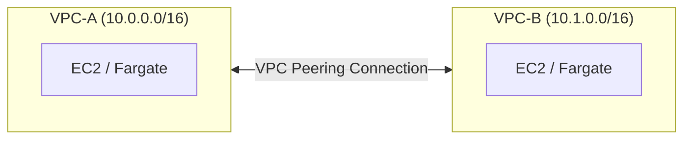
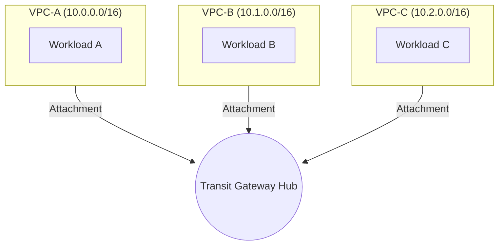

# Cẩm nang Kiến thức Toàn diện W5 — Phần 1: MH1 & MH2

> **Phạm vi:** Tài liệu này bao phủ **100% kiến thức** trong đề bài W5 — bao gồm tất cả các Path/Pattern, không chỉ những gì team đã chọn triển khai.
> 👉 [Xem Phần 2: MH3, MH4, MH5](file:///d:/Workspace/Study/AWS/Kicks-Shoes-AWS/docs/guide/week5/w5_full_knowledge_part2.md)

---

## MH1 — Multi-VPC Connectivity (Làm cho Network Quan sát được)

### 📚 Định nghĩa Tổng quan
**Multi-VPC Connectivity** là chiến lược kết nối giữa các VPC (mạng ảo riêng) trong AWS. Tùy vào quy mô và nhu cầu kiến trúc, bạn có thể chọn 1 trong 3 hướng đi (Path) khác nhau.

### 📚 Bảng Thuật ngữ MH1

| Thuật ngữ | Định nghĩa dễ hiểu |
| :--- | :--- |
| **VPC Peering** | Đường hầm kết nối **trực tiếp** giữa 2 VPC. Traffic đi thẳng point-to-point, không qua Internet. Giống như **xây cầu nối giữa 2 tòa nhà**. |
| **Transit Gateway (TGW)** | Bộ **hub trung tâm** kết nối nhiều VPC (3+). Giống **bùng binh giao thông** — mọi tòa nhà nối vào bùng binh, từ đó đi đến bất kỳ tòa nào khác. |
| **CIDR** | Dải địa chỉ IP được cấp cho VPC (VD: `10.0.0.0/16`). Khi peering, 2 VPC **không được có CIDR trùng nhau** (giống 2 tòa nhà không được đánh số phòng giống nhau). |
| **Transitive Routing** | Khả năng VPC A nói chuyện với VPC C **thông qua** VPC B. VPC Peering **không hỗ trợ** tính năng này — phải dùng Transit Gateway. |
| **VPC Flow Logs** | Nhật ký ghi lại metadata (IP nguồn, đích, port, ACCEPT/REJECT) của mọi gói tin trong VPC. **Bắt buộc bật** cho mọi Path. |
| **Multi-AZ** | Triển khai tài nguyên trên **nhiều Availability Zone** (trung tâm dữ liệu vật lý cách xa nhau). Nếu 1 AZ sập → AZ còn lại vẫn chạy. |

---

### 🛤️ Path A — VPC Peering (Cầu nối Trực tiếp)

#### Khi nào chọn?
Team có **2-3 VPC** với CIDR không chồng lấn và cần traffic trực tiếp point-to-point giữa chúng.

#### 📚 Định nghĩa chi tiết
**VPC Peering Connection** là kết nối mạng 1-1 giữa 2 VPC, cho phép traffic chảy qua hạ tầng nội bộ AWS (không qua Internet). Đặc điểm quan trọng:
- **Không transitive:** Nếu VPC-A peer với VPC-B, và VPC-B peer với VPC-C → VPC-A **KHÔNG** tự động nói chuyện được với VPC-C.
- **CIDR không được trùng:** VPC-A dùng `10.0.0.0/16` thì VPC-B không được dùng cùng dải.
- **Cross-region:** Có thể peering giữa 2 VPC ở khác region (VD: us-east-1 ↔ ap-southeast-1).

#### Sơ đồ kiến trúc


#### 💻 Code Terraform mẫu
```hcl
# Bước 1: Tạo cầu nối (Peering Connection) giữa 2 VPC
resource "aws_vpc_peering_connection" "a_to_b" {
  vpc_id      = aws_vpc.vpc_a.id     # VPC khởi tạo kết nối (Requester)
  peer_vpc_id = aws_vpc.vpc_b.id     # VPC bên kia (Accepter)
  auto_accept = true                  # Tự động chấp nhận (chỉ dùng khi cùng account)
}

# Bước 2: Cập nhật Route Table VPC-A → "Muốn đến 10.1.0.0/16, đi qua cầu Peering"
resource "aws_route" "a_to_b" {
  route_table_id            = aws_route_table.vpc_a_private.id
  destination_cidr_block    = "10.1.0.0/16"          # Dải IP của VPC-B
  vpc_peering_connection_id = aws_vpc_peering_connection.a_to_b.id
}

# Bước 3: Cập nhật Route Table VPC-B → "Muốn đến 10.0.0.0/16, đi qua cầu Peering"
resource "aws_route" "b_to_a" {
  route_table_id            = aws_route_table.vpc_b_private.id
  destination_cidr_block    = "10.0.0.0/16"          # Dải IP của VPC-A
  vpc_peering_connection_id = aws_vpc_peering_connection.a_to_b.id
}
```

#### 🖥️ Cách xem trên AWS Console
1. Mở **VPC** → Menu trái chọn **Peering connections** → Thấy kết nối ở trạng thái `Active`.
2. Mở **Route tables** → Chọn route table của mỗi VPC → Tab **Routes** → Xác nhận có route trỏ đến `pcx-...` (Peering Connection ID).
3. **Test connectivity:** SSH vào EC2 trong VPC-A → `curl http://<private-ip-vpc-b>:3000/api/health` → Phải trả về 200.

---

### 🛤️ Path B — AWS Transit Gateway (Bùng binh Trung tâm)

#### Khi nào chọn?
Team có **3 VPC trở lên**, hoặc cần transitive routing, hoặc dự định thêm kết nối VPN/Direct Connect sau này.

#### 📚 Định nghĩa chi tiết
**Transit Gateway (TGW)** là bộ hub trung tâm do AWS quản lý, cho phép kết nối nhiều VPC, VPN, và Direct Connect thông qua một điểm duy nhất. Đặc điểm:
- **Transitive routing:** VPC-A → TGW → VPC-C mà không cần peering trực tiếp A↔C.
- **TGW Route Table:** Bảng định tuyến riêng của Transit Gateway, quyết định traffic từ VPC nào được đi đến VPC nào.
- **TGW Attachment:** Mỗi VPC phải "gắn vào" (attach) Transit Gateway thì mới tham gia mạng lưới.

#### Sơ đồ kiến trúc


#### 💻 Code Terraform mẫu
```hcl
# Bước 1: Tạo Transit Gateway (Bùng binh)
resource "aws_ec2_transit_gateway" "main" {
  description                     = "Central hub for multi-VPC connectivity"
  default_route_table_association = "enable"  # Tự động gắn VPC vào route table mặc định
  default_route_table_propagation = "enable"  # Tự động quảng bá route
}

# Bước 2: Gắn từng VPC vào Transit Gateway
resource "aws_ec2_transit_gateway_vpc_attachment" "vpc_a" {
  transit_gateway_id = aws_ec2_transit_gateway.main.id
  vpc_id             = aws_vpc.vpc_a.id
  subnet_ids         = aws_subnet.vpc_a_private[*].id  # Subnet nào sẽ kết nối vào TGW
}

resource "aws_ec2_transit_gateway_vpc_attachment" "vpc_b" {
  transit_gateway_id = aws_ec2_transit_gateway.main.id
  vpc_id             = aws_vpc.vpc_b.id
  subnet_ids         = aws_subnet.vpc_b_private[*].id
}

# Bước 3: Cập nhật Route Table VPC-A → "Traffic đến VPC-B đi qua TGW"
resource "aws_route" "vpc_a_to_tgw" {
  route_table_id         = aws_route_table.vpc_a_private.id
  destination_cidr_block = "10.1.0.0/16"
  transit_gateway_id     = aws_ec2_transit_gateway.main.id
}
```

#### 🖥️ Cách xem trên AWS Console
1. Mở **VPC** → Menu trái chọn **Transit gateways** → Thấy TGW ở trạng thái `Available`.
2. Chọn **Transit gateway attachments** → Thấy danh sách các VPC đã gắn vào TGW.
3. Chọn **Transit gateway route tables** → Click vào route table → Tab **Routes** → Xem traffic được định tuyến đến VPC nào.

---

### 🛤️ Path C — Justified Single-VPC (VPC Đơn có Giải trình) ⭐ *Team Kicks Shoes đã chọn Path này*

#### Khi nào chọn?
Ứng dụng thực sự chạy đúng trong **một VPC duy nhất** được thiết kế tốt (multi-tier, multi-AZ) và không có business case nào để tách thành nhiều VPC.

#### 📚 Yêu cầu bắt buộc của Path C
Path này **KHÔNG phải** là "không làm gì" — nó đòi hỏi:
1. **Justification viết tay:** Giải thích cụ thể tại sao ứng dụng của team không cần nhiều VPC.
2. **Multi-AZ:** Mọi tầng subnet phải triển khai trên **ít nhất 2 Availability Zones**.
3. **Trigger events:** Viết ra sự kiện kiến trúc nào sẽ buộc team phải tạo thêm VPC thứ hai.
4. **VPC Flow Logs:** Bắt buộc bật (giống mọi Path khác).

#### Justification của Team Kicks Shoes
> Kicks Shoes là ứng dụng **thương mại điện tử đơn khối (monolith)** chạy trên một cụm ECS Fargate duy nhất. Toàn bộ logic nghiệp vụ (API, thanh toán, quản lý sản phẩm) nằm trong cùng một codebase Node.js. Database chính là MongoDB Atlas (ngoài AWS), cache là ElastiCache Redis. Không có microservice nào cần cách ly về mặt mạng. VPC đã được chia multi-tier (Public, Private, Intra, Database) và multi-AZ (2 AZ: us-east-1a, us-east-1b).
>
> **Sự kiện trigger VPC thứ hai:**
> - Tách microservice thanh toán (Payment) ra thành service độc lập cần cách ly PCI-DSS.
> - Bổ sung môi trường Staging/Production riêng biệt với network boundary hoàn toàn tách rời.
> - Tích hợp hệ thống đối tác bên ngoài qua VPN/Direct Connect.

#### Cách team đã triển khai Multi-AZ
```hcl
# File: 01-network/main.tf
module "vpc" {
  # Chạy trên 2 AZ → Mỗi tầng subnet có 2 bản sao
  azs = slice(data.aws_availability_zones.available.names, 0, 2)
  # Kết quả: us-east-1a + us-east-1b

  public_subnets   = ["10.0.1.0/24", "10.0.2.0/24"]    # 2 subnet public, mỗi AZ 1 cái
  private_subnets  = ["10.0.11.0/24", "10.0.12.0/24"]   # 2 subnet private
  database_subnets = ["10.0.31.0/24", "10.0.32.0/24"]   # 2 subnet database
  intra_subnets    = ["10.0.21.0/24", "10.0.22.0/24"]   # 2 subnet firewall
}
```

#### 🖥️ Cách xem Multi-AZ trên AWS Console
1. Mở **VPC** → **Subnets** → Lọc theo VPC → Thấy **8 subnet** (4 tầng × 2 AZ).
2. Cột **Availability Zone** hiển thị mỗi tầng có subnet ở cả `us-east-1a` và `us-east-1b`.

---

### 📋 Phần Bắt buộc cho Mọi Path: VPC Flow Logs

Dù chọn Path A, B hay C, bạn **bắt buộc** phải bật VPC Flow Logs trên **mọi VPC** và show sample log entry.

*(Chi tiết code Terraform và cách xem Console đã được trình bày đầy đủ trong file [w5_must_haves_mapping.md](file:///d:/Workspace/Study/AWS/Kicks-Shoes-AWS/docs/guide/week5/w5_must_haves_mapping.md) — Mục 1. MH1)*

---

## MH2 — Network Firewall Hardening (Ép buộc Bảo mật tại Biên)

### 📚 Định nghĩa Tổng quan
**Hardening** là quá trình gia cố bảo mật hệ thống bằng cách giảm bề mặt tấn công (Attack Surface). Ở tầng mạng, điều này có nghĩa là kiểm soát chặt chẽ traffic nào được đi ra/vào VPC.

### 📚 Bảng Thuật ngữ MH2

| Thuật ngữ | Định nghĩa dễ hiểu |
| :--- | :--- |
| **Security Group (SG)** | **Bảo vệ riêng** đứng trước cửa mỗi tài nguyên (EC2, Lambda, RDS). Hoạt động ở tầng instance. Chỉ có ALLOW rules, mặc định chặn hết. |
| **NACL (Network ACL)** | **Cổng barie** đặt ở ranh giới mỗi Subnet. Có cả ALLOW và DENY rules. Hoạt động ở tầng subnet. |
| **Network Firewall** | **Tường lửa cấp doanh nghiệp** đặt ở biên VPC. Kiểm tra deep packet, lọc domain, phát hiện xâm nhập. Mạnh hơn SG và NACL nhiều lần. |
| **Egress Traffic** | Traffic **đi ra** Internet từ tài nguyên trong VPC. |
| **Ingress Traffic** | Traffic **đi vào** VPC từ Internet. |
| **Alert Logs** | Log ghi lại các traffic **bị chặn** hoặc vi phạm quy tắc tường lửa. |
| **VPC Endpoint** | Đường hầm riêng kết nối VPC trực tiếp đến dịch vụ AWS (S3, DynamoDB, Secrets Manager) **mà không cần đi qua Internet**. |
| **Negative Test** | Bài kiểm tra chứng minh hệ thống **chặn đúng** — cố tình tấn công/vi phạm và xác nhận bị từ chối. |

---

### 🛤️ Path A — Deploy AWS Network Firewall ⭐ *Team Kicks Shoes đã chọn Path này*

#### Khi nào BẮT BUỘC chọn?
**Nếu bất kỳ EC2, Fargate hay Lambda nào trong stack ra Internet qua NAT Gateway → Bắt buộc Path A.**
Team Kicks Shoes có ECS Fargate cần gọi MongoDB Atlas, Gemini API, Docker Hub qua NAT Gateway → Path A là bắt buộc.

#### 📚 Định nghĩa chi tiết
Triển khai **AWS Network Firewall** với:
- **Firewall Subnet riêng** (Intra Subnet) để đặt Firewall Endpoint.
- Ít nhất **1 Stateful Rule Group** (domain-based egress allowlist hoặc IPS signature).
- **Alert Logs** bật để ghi nhận traffic bị chặn.
- **Route Table** cập nhật: traffic phải đi qua Firewall **trước** NAT Gateway.

#### Yêu cầu chứng minh
- ✅ Show một request **được cho phép** đi qua (thấy trong Flow Logs).
- ❌ Show một request **bị chặn** (thấy trong Alert Logs).

*(Chi tiết code Terraform đầy đủ — Allowlist, Firewall Policy, Routing, Logging — đã trình bày trong file [w5_must_haves_mapping.md](file:///d:/Workspace/Study/AWS/Kicks-Shoes-AWS/docs/guide/week5/w5_must_haves_mapping.md) — Mục 2. MH2)*

---

### 🛤️ Path B — Hardened SG + NACL (Khi Không có NAT Gateway)

#### Khi nào chọn?
Topology thực sự **cô lập hoàn toàn** khỏi Internet:
- Mọi dịch vụ AWS truy cập qua **VPC Endpoint** (không qua Internet).
- **Không có NAT Gateway** — không có đường ra Internet từ bất kỳ instance/Lambda nào.

#### 📚 Định nghĩa chi tiết

**VPC Endpoint** là đường hầm riêng nối VPC trực tiếp vào dịch vụ AWS mà không cần qua Internet. Có 2 loại:
| Loại | Dịch vụ hỗ trợ | Chi phí |
| :--- | :--- | :--- |
| **Gateway Endpoint** | S3, DynamoDB | Miễn phí |
| **Interface Endpoint** | Hầu hết dịch vụ còn lại (Secrets Manager, ECR, CloudWatch...) | ~$7.2/tháng mỗi endpoint |

#### Yêu cầu của Path B
1. **Viết justification:** (a) Vì sao egress firewall không cần thiết, (b) Traffic nào sẽ đòi deploy firewall trong production.
2. **Xóa mọi rule inbound `0.0.0.0/0` port 22/3389** trên tất cả Security Group (không cho SSH/RDP từ mọi nơi).
3. **Thêm ít nhất 1 NACL DENY rule rõ ràng.**
4. **Negative test:** Show kết nối bị từ chối kèm screenshot.

#### 💻 Code Terraform mẫu — NACL DENY Rule
```hcl
# Tạo NACL tùy chỉnh cho Private Subnet
resource "aws_network_acl" "private" {
  vpc_id     = aws_vpc.main.id
  subnet_ids = [aws_subnet.private_a.id, aws_subnet.private_b.id]

  # Rule DENY rõ ràng: Chặn SSH (port 22) từ mọi nơi vào Private Subnet
  ingress {
    rule_no    = 50       # Số thứ tự (xử lý từ nhỏ đến lớn)
    protocol   = "tcp"
    action     = "deny"   # CHẶN
    cidr_block = "0.0.0.0/0"  # Từ mọi IP
    from_port  = 22
    to_port    = 22
  }

  # Rule DENY: Chặn RDP (port 3389) — Windows Remote Desktop
  ingress {
    rule_no    = 60
    protocol   = "tcp"
    action     = "deny"
    cidr_block = "0.0.0.0/0"
    from_port  = 3389
    to_port    = 3389
  }

  # Rule ALLOW: Cho phép các traffic hợp lệ còn lại (phải đặt sau DENY)
  ingress {
    rule_no    = 100
    protocol   = "-1"     # Mọi giao thức
    action     = "allow"
    cidr_block = "10.0.0.0/16"  # Chỉ từ trong VPC
    from_port  = 0
    to_port    = 0
  }

  # Egress: Cho phép tất cả traffic đi ra
  egress {
    rule_no    = 100
    protocol   = "-1"
    action     = "allow"
    cidr_block = "0.0.0.0/0"
    from_port  = 0
    to_port    = 0
  }
}
```

#### So sánh Security Group vs NACL

| Tiêu chí | Security Group | NACL |
| :--- | :--- | :--- |
| **Phạm vi** | Tầng instance (ENI) | Tầng subnet (mọi instance trong subnet) |
| **Loại rule** | Chỉ ALLOW | Cả ALLOW và DENY |
| **Stateful/Stateless** | **Stateful** (tự nhớ kết nối) | **Stateless** (phải khai báo cả inbound và outbound) |
| **Thứ tự xử lý** | Tất cả rules đánh giá cùng lúc | Từ rule number nhỏ → lớn, dừng ở match đầu tiên |

#### 🖥️ Cách xem trên AWS Console
1. **Xem Security Group:** **VPC** → **Security groups** → Click vào SG → Tab **Inbound rules** → Kiểm tra KHÔNG có rule `0.0.0.0/0` port 22 hoặc 3389.
2. **Xem NACL:** **VPC** → **Network ACLs** → Click vào NACL → Tab **Inbound rules** → Thấy rule DENY cho port 22/3389.
3. **Xem VPC Endpoints:** **VPC** → **Endpoints** → Thấy danh sách Gateway/Interface Endpoints đang Active.

---

> 👉 **Tiếp tục đọc Phần 2:** [MH3, MH4, MH5 — File Storage & Backup, API Gateway, Serverless Scaling](file:///d:/Workspace/Study/AWS/Kicks-Shoes-AWS/docs/guide/week5/w5_full_knowledge_part2.md)
