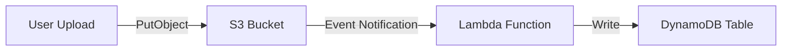

# Cẩm nang Kiến thức Toàn diện W5 — Phần 2: MH3, MH4, MH5

> 👉 [Xem lại Phần 1: MH1 & MH2](file:///d:/Workspace/Study/AWS/Kicks-Shoes-AWS/docs/guide/week5/w5_full_knowledge_part1.md)

---

## MH3 — File Storage Layer + Backup Plan (Chia sẻ Data, Bảo vệ State)

### 📚 Bảng Thuật ngữ MH3

| Thuật ngữ | Định nghĩa dễ hiểu |
| :--- | :--- |
| **EFS (Elastic File System)** | **Ổ cứng mạng dùng chung** dạng NFS. Nhiều EC2/Lambda/Fargate có thể đọc/ghi cùng lúc. Tự động co giãn dung lượng. |
| **FSx** | Hệ thống file quản lý của AWS cho **Windows (FSx for Windows)** hoặc **HPC (FSx for Lustre)**. Dùng khi cần giao thức SMB hoặc hiệu năng cực cao. |
| **Mount Target** | Ổ cắm mạng đặt trong Subnet để EC2/Fargate kết nối vào EFS. Mỗi AZ cần 1 Mount Target. |
| **Access Point** | Cổng vào có quyền hạn cụ thể trên EFS. Giới hạn thư mục gốc, UID/GID, quyền đọc/ghi. |
| **AWS Backup Vault** | Két sắt chứa các bản sao lưu (Recovery Points). Tách biệt khỏi dữ liệu gốc. |
| **Backup Plan** | Lịch hẹn giờ tự động chụp Snapshot. Có schedule (khi nào chụp) và lifecycle (giữ bao lâu). |
| **Recovery Point** | Một bản chụp Snapshot tại một thời điểm cụ thể. Dùng để khôi phục (Restore) khi cần. |
| **Restore Test** | **BẮT BUỘC.** Khôi phục dữ liệu từ Recovery Point, kết nối vào tài nguyên đã khôi phục, và đọc lại data để xác nhận. |
| **Vault Lock** | *(Stretch goal)* Khóa Vault ở chế độ Compliance — không IAM principal nào (kể cả root) xóa được recovery point trước khi retention hết. |

### 🎯 Mục đích
- **File storage:** Tạo lớp file **dùng chung** cho app tier, phục vụ nội dung thật: file upload, session data, config chung.
- **Backup:** Bảo vệ **mọi tài nguyên có state** — EFS, Database (RDS/DynamoDB), EBS volume. Backup chưa từng restore = hy vọng, không phải kế hoạch.

### Yêu cầu cụ thể

| Hạng mục | Yêu cầu |
| :--- | :--- |
| **EFS/FSx** | Mount vào instance/Fargate trong **private subnet**. SG mount target chỉ allow từ SG app tier. |
| **Nội dung** | Phải phục vụ **nội dung thật** của ứng dụng (file upload, avatar, config...) |
| **Backup Plan** | Bao trùm **≥ 3 loại resource**: file system (EFS), database (DynamoDB/RDS), EBS volume. Schedule ≥ daily, retention ≥ 7 ngày. |
| **Restore Test** | Trigger restore → Đợi complete → Connect vào resource khôi phục → **Đọc lại data** → Screenshot vào Evidence Pack. |

### 💻 Code Terraform — Kicks Shoes đã cấu hình

*(Chi tiết EFS + Backup Plan đã trình bày đầy đủ trong [w5_must_haves_part2.md](file:///C:/Users/phuct/.gemini/antigravity/brain/9bca45c4-0841-49b0-911d-a9ad75c79595/w5_must_haves_part2.md) — Mục 3. MH3)*

### 🖥️ Cách xem trên AWS Console

**Xem EFS:**
1. Mở **EFS** → **File systems** → Click `kicks-shoes-dev-tientp-efs`.
2. Tab **Network** → Thấy Mount Targets trong mỗi AZ + Security Group được gán.
3. Tab **Access points** → Thấy thư mục gốc (`/uploads`) và quyền UID/GID.

**Xem AWS Backup:**
1. Mở **AWS Backup** → **Backup vaults** → Click `kicks-shoes-dev-tientp-backup-vault`.
2. Xem danh sách **Recovery points** — mỗi dòng là 1 bản Snapshot đã chụp thành công.
3. **Backup plans** → Click plan → Tab **Resource assignments** → Xem 3 loại resource được chụp.

**Restore Test:**
1. Trong **Backup vaults** → Chọn 1 Recovery point → Click **Restore**.
2. Đợi trạng thái chuyển sang **Completed** trong tab **Restore jobs**.
3. Kết nối vào tài nguyên đã khôi phục → Đọc data → Screenshot.

---

## MH4 — API Gateway trước Lambda (Surface API Tử tế)

### 📚 Bảng Thuật ngữ MH4

| Thuật ngữ | Định nghĩa dễ hiểu |
| :--- | :--- |
| **REST API** | Loại API Gateway **đầy đủ tính năng nhất**: hỗ trợ API Key, Usage Plan, Request Validation, SDK Generation. Phí cao hơn HTTP API. |
| **HTTP API** | Loại API Gateway **nhẹ, rẻ, nhanh hơn**: hỗ trợ JWT Authorizer native, Lambda Authorizer, CORS tự động. Phí rẻ hơn REST API ~70%. |
| **Lambda Proxy Integration** | Chế độ tích hợp mà API Gateway **chuyển toàn bộ HTTP request** (headers, body, query params) xuống Lambda dưới dạng JSON event. Lambda trả về response đầy đủ (statusCode, headers, body). |
| **Usage Plan** | *(REST API)* Gói giới hạn sử dụng: rate limit (req/s), burst, quota (req/tháng). Gắn với API Key. |
| **Throttling** | Giới hạn số request/giây để bảo vệ backend. Vượt quá → HTTP 429 (Too Many Requests). |
| **API Key** | Chuỗi ký tự bí mật gửi trong header `x-api-key`. Dùng để định danh client và áp dụng Usage Plan. |
| **Lambda Authorizer** | Hàm Lambda kiểm tra token/credentials trước mỗi request. Trả về "Allow" hoặc "Deny". |
| **Cognito Authorizer** | Dùng Cognito User Pool kiểm tra JWT Token. Không cần viết code xác thực — AWS tự validate. |
| **Stage** | Phiên bản deployment của API (dev, staging, prod). Mỗi stage có URL riêng. |

### 🎯 Mục đích
Đặt **API Gateway trước Lambda** thay vì gọi Lambda trực tiếp. Lý do:
- **Throttling:** Không có → Bot spam → Lambda chạy hàng triệu lần → Hóa đơn nổ tung.
- **Authentication:** Xác thực ngay tại cổng, request giả mạo không bao giờ chạm Lambda.
- **URL frontend gọi được:** API Gateway cung cấp HTTPS URL chuẩn, không cần invoke SDK.

### So sánh REST API vs HTTP API

| Tiêu chí | REST API | HTTP API |
| :--- | :--- | :--- |
| **Chi phí** | $3.50 / triệu request | $1.00 / triệu request |
| **Độ trễ** | ~15ms overhead | ~5ms overhead |
| **Auth hỗ trợ** | API Key, Lambda Auth, Cognito, IAM | JWT Auth (native), Lambda Auth |
| **API Key + Usage Plan** | ✅ Có | ❌ Không |
| **Request Validation** | ✅ Có | ❌ Không |
| **Khi nào chọn** | Cần API Key, Usage Plan, validation phức tạp | Cần rẻ, nhanh, JWT auth đơn giản |

### So sánh 3 Phương thức Authentication

| Phương thức | Cách hoạt động | Khi nào dùng |
| :--- | :--- | :--- |
| **API Key** | Client gửi key trong header `x-api-key`. Gateway kiểm tra key hợp lệ + áp Usage Plan. | Giới hạn rate cho partner/developer bên ngoài. |
| **Lambda Authorizer** | Gateway gọi Lambda kiểm tra token tùy chỉnh (JWT, custom token). Lambda trả Allow/Deny. | Auth logic phức tạp, token format tùy chỉnh, đọc secret từ Secrets Manager. |
| **Cognito Authorizer** | Gateway tự động validate JWT token từ Cognito User Pool. Không cần viết code. | Đã dùng Cognito làm identity provider. Đơn giản nhất. |

### Yêu cầu chứng minh
- ✅ Curl test **có auth** → HTTP 200 (request hợp lệ).
- ❌ Curl test **không auth** → HTTP 401/403 (bị từ chối).

### 💻 Kicks Shoes đã cấu hình: HTTP API + Lambda Authorizer

*(Chi tiết code Terraform đã trình bày trong [w5_must_haves_part2.md](file:///C:/Users/phuct/.gemini/antigravity/brain/9bca45c4-0841-49b0-911d-a9ad75c79595/w5_must_haves_part2.md) — Mục 4. MH4)*

### 🖥️ Cách xem trên AWS Console
1. Mở **API Gateway** → Click `kicks-shoes-dev-tientp-bedrock-api`.
2. Menu trái **Routes** → Thấy `POST /chat` với Authorizer gắn kèm.
3. Menu trái **Authorization** → Click route → Thấy `jwt-authorizer` đang active.
4. Menu trái **Stages** → `$default` → Xem Throttling settings (Rate: 10, Burst: 20).

---

## MH5 — Serverless Scaling Pattern (Xử lý Tải Đúng Cách)

### 📚 Định nghĩa Tổng quan
Lambda mặc định cho phép concurrency không giới hạn (đến account limit ~1000). Trong production, điều này **hỏng theo cách dễ đoán**: một function ăn hết concurrency của cả account, cold start làm chậm API, lỗi xử lý không có nơi cất → mất data. MH5 yêu cầu chọn **1 trong 4 pattern** và áp dụng lên Lambda thật trong ứng dụng.

### 📚 Bảng Thuật ngữ MH5

| Thuật ngữ | Định nghĩa dễ hiểu |
| :--- | :--- |
| **Concurrency** | Số lượng Lambda instance **chạy cùng lúc** tại một thời điểm. |
| **Cold Start** | Thời gian khởi tạo môi trường chạy khi Lambda **chưa có instance sẵn sàng**. Thường 500ms-5s tùy runtime/package size. |
| **Init Duration** | Thời gian cold start đo được trong CloudWatch trace. Init Duration = 0 → Không có cold start. |
| **Throttle** | Khi số request vượt quá giới hạn concurrency → Lambda từ chối request mới với lỗi `TooManyRequestsException` (HTTP 429). |
| **Async Invocation** | Gọi Lambda kiểu **"gửi rồi quên"** (Fire-and-forget). Client không chờ kết quả — Lambda xử lý ngầm. |
| **Dead-Letter Queue (DLQ)** | Hàng đợi chứa event **bị lỗi** sau khi cạn kiệt retry. Giúp cô lập lỗi, không mất data. |
| **Event Source Mapping** | Cầu nối tự động đọc event từ nguồn (DynamoDB Streams, SQS, Kinesis) và gọi Lambda. |
| **S3 Event Notification** | Cơ chế S3 tự động gửi thông báo (trigger Lambda/SQS/SNS) khi có file mới upload. |

---

### 🛤️ Pattern 1 — Reserved Concurrency (Giới hạn Đặt trước)

#### Khi nào chọn?
Function có thể **nuốt hết account concurrency limit** — ví dụ batch processor trigger bởi S3 event lúc import dữ liệu lớn.

#### 📚 Cách hoạt động
Đặt số concurrency tối đa cho 1 function cụ thể. Ví dụ: set 50 → Tối đa 50 instance chạy cùng lúc → Request thứ 51 bị throttle → Các function khác trong account vẫn còn concurrency để dùng.

#### 💻 Code Terraform
```hcl
resource "aws_lambda_function" "batch_processor" {
  function_name = "batch-processor"
  # ... config khác ...

  # Giới hạn: Tối đa 50 instance chạy cùng lúc
  reserved_concurrent_executions = 50
}
```

#### Yêu cầu chứng minh
Invoke nhiều hơn limit → Screenshot metric **`Throttles`** trong CloudWatch hoặc response `TooManyRequestsException`.

#### 🖥️ Cách xem trên Console
1. **Lambda** → Click function → Tab **Configuration** → **Concurrency** → Thấy "Reserved concurrency: 50".
2. **CloudWatch** → **Metrics** → **Lambda** → Chọn function → Metric `Throttles` → Thấy giá trị > 0 khi vượt limit.

---

### 🛤️ Pattern 2 — Provisioned Concurrency (Làm ấm Trước)

#### Khi nào chọn?
Function đứng sau API Gateway (MH4) cần **loại bỏ cold start** để đảm bảo response time ổn định (< 100ms).

#### 📚 Cách hoạt động
AWS giữ sẵn N instance Lambda **luôn nóng** (pre-warmed). Khi request đến → Không cần khởi tạo → Init Duration = 0ms. **Chi phí cao hơn** vì trả tiền cho instance ngay cả khi không có request.

#### 💻 Code Terraform
```hcl
# Tạo alias (phiên bản đặt tên) cho Lambda
resource "aws_lambda_alias" "live" {
  name             = "live"
  function_name    = aws_lambda_function.api_handler.function_name
  function_version = aws_lambda_function.api_handler.version
}

# Provisioned Concurrency: Giữ ấm 5 instance
resource "aws_lambda_provisioned_concurrency_config" "api" {
  function_name                  = aws_lambda_alias.live.function_name
  qualifier                      = aws_lambda_alias.live.name
  provisioned_concurrent_executions = 5  # Luôn có 5 instance sẵn sàng
}
```

#### Yêu cầu chứng minh
So sánh CloudWatch trace **trước** (thấy Init Duration > 0) và **sau** (Init Duration = 0ms). Ghi chú chi phí vào Evidence Pack.

#### 🖥️ Cách xem trên Console
1. **Lambda** → Click function → Tab **Configuration** → **Concurrency** → "Provisioned concurrency: 5".
2. **CloudWatch** → **Logs** → Xem trace: `REPORT ... Init Duration: 0 ms` = Không cold start.

---

### 🛤️ Pattern 3 — Async Invocation + Dead-Letter Queue ⭐ *Team Kicks Shoes đã chọn Pattern này*

#### Khi nào chọn?
Function xử lý tác vụ **nặng, không cần trả kết quả ngay** — gọi AI model, xử lý ảnh, gửi email batch.

#### 📚 Cách hoạt động
1. Client/Trigger gửi event kiểu **async** (invocation type = Event).
2. Lambda nhận event → Xử lý ngầm → Client không chờ.
3. Nếu lỗi → Lambda tự động retry (mặc định 2 lần).
4. Vẫn lỗi → Event chuyển vào **DLQ** (SQS/SNS) để cất giữ an toàn.

#### Yêu cầu chứng minh
Demo invocation thất bại → Show message trong DLQ kèm chi tiết lỗi.

#### Kicks Shoes đã triển khai
- **DynamoDB Streams** trigger Lambda `bedrock-chat` (async mặc định).
- `maximum_retry_attempts = 2` → Thử lại 2 lần.
- Lỗi → SQS DLQ `kicks-shoes-dev-tientp-bedrock-dlq` → Lưu 14 ngày.

*(Chi tiết code đã trình bày trong [w5_must_haves_part2.md](file:///C:/Users/phuct/.gemini/antigravity/brain/9bca45c4-0841-49b0-911d-a9ad75c79595/w5_must_haves_part2.md) — Mục 5. MH5)*

#### 🖥️ Cách xem trên Console
1. **Lambda** → Click `bedrock-chat` → Tab **Configuration** → **Triggers** → Thấy DynamoDB Stream.
2. **SQS** → Click `kicks-shoes-dev-tientp-bedrock-dlq` → **Send and receive messages** → **Poll for messages** → Xem tin nhắn lỗi.

---

### 🛤️ Pattern 4 — S3-Event-Triggered Lambda

#### Khi nào chọn?
Mọi nhóm đều có thể dùng. Phù hợp khi cần xử lý file ngay khi upload lên S3 (trích metadata, đồng bộ DB, trigger pipeline).

#### 📚 Cách hoạt động
1. User upload file lên S3 bucket (hoặc prefix cụ thể).
2. S3 phát ra **PutObject event notification**.
3. Lambda được trigger tự động → Đọc file mới → Trích field chính → Ghi vào DynamoDB.



#### 💻 Code Terraform
```hcl
# Bước 1: Cho phép S3 gọi Lambda
resource "aws_lambda_permission" "s3_trigger" {
  statement_id  = "AllowS3Invoke"
  action        = "lambda:InvokeFunction"
  function_name = aws_lambda_function.file_processor.function_name
  principal     = "s3.amazonaws.com"
  source_arn    = aws_s3_bucket.uploads.arn
}

# Bước 2: Cấu hình S3 Event Notification
resource "aws_s3_bucket_notification" "file_upload" {
  bucket = aws_s3_bucket.uploads.id

  lambda_function {
    lambda_function_arn = aws_lambda_function.file_processor.arn
    events              = ["s3:ObjectCreated:*"]   # Trigger khi có file mới
    filter_prefix       = "uploads/"               # Chỉ trong thư mục uploads/
    filter_suffix       = ".jpg"                   # Chỉ file .jpg
  }
}
```

#### Yêu cầu chứng minh
Show flow end-to-end: Thả file vào S3 → CloudWatch log Lambda → Output row trong DynamoDB.

#### 🖥️ Cách xem trên Console
1. **S3** → Click bucket → Tab **Properties** → Kéo xuống **Event notifications** → Thấy Lambda trigger.
2. Upload 1 file test → Mở **CloudWatch Logs** → Tìm log group Lambda → Xem log xử lý.
3. Mở **DynamoDB** → **Tables** → Click bảng output → **Explore table items** → Xem row mới.

---

## Tổng kết: Team Kicks Shoes đã chọn những Path/Pattern nào?

| Must-Have | Path/Pattern đã chọn | Lý do |
| :--- | :--- | :--- |
| **MH1** | **Path C — Single-VPC** | Ứng dụng monolith, VPC đã multi-tier (4 tầng) và multi-AZ (2 AZ). |
| **MH2** | **Path A — Network Firewall** | Fargate cần gọi MongoDB Atlas, Gemini API qua NAT Gateway → Bắt buộc Path A. |
| **MH3** | **EFS + AWS Backup** | EFS gắn vào Fargate, Backup daily cho EFS + DynamoDB, retention 7 ngày. |
| **MH4** | **HTTP API + Lambda Authorizer** | Rẻ hơn REST API, JWT auth tùy chỉnh qua Lambda Authorizer, throttling 10/20. |
| **MH5** | **Pattern 3 — Async + DLQ** | Chat AI xử lý bất đồng bộ qua DynamoDB Streams, DLQ cất thư lỗi 14 ngày. |
