# Cẩm nang AWS Tuần 5 — Phần 2: MH3, MH4, MH5

> 👉 [Xem lại Phần 1: Thuật ngữ, MH1 & MH2](file:///C:/Users/phuct/.gemini/antigravity/brain/9bca45c4-0841-49b0-911d-a9ad75c79595/w5_must_haves_mapping.md)

---

## 3. MH3 — EFS Attached & AWS Backup (Ổ Cứng Rời & Nhiếp Ảnh Gia Tự Động)

### 📚 Định nghĩa Thuật ngữ
| Khái niệm | Định nghĩa |
| :--- | :--- |
| **EFS (Elastic File System)** | Hệ thống tệp mạng (NFS) được quản lý bởi AWS. Giống **ổ cứng gắn ngoài qua mạng LAN**, nhiều máy tính (container) có thể đọc/ghi cùng lúc. Dữ liệu tồn tại vĩnh viễn, không phụ thuộc vào việc container có đang chạy hay không. |
| **EFS Mount Target** | **Ổ cắm mạng** nằm trong mỗi Subnet. Muốn container gắn được ổ cứng EFS, bạn phải đặt ổ cắm (Mount Target) vào đúng Subnet mà container đang chạy. |
| **EFS Access Point** | **Thư mục mặc định** khi container truy cập vào EFS. Giống như khi bạn cắm USB, máy tính tự mở đúng thư mục `D:\uploads` thay vì thư mục gốc. |
| **AWS Backup Vault** | **Két sắt** chuyên dụng để cất giữ các bản sao lưu (Snapshot). Tách biệt khỏi dữ liệu gốc. |
| **AWS Backup Plan** | **Lịch hẹn giờ** tự động chụp ảnh dữ liệu. Ví dụ: "Hàng ngày lúc 2h sáng, chụp EFS và DynamoDB". |
| **Backup Selection** | **Danh sách tài nguyên** cần sao lưu. Bạn chỉ vào cụ thể: "Chụp cái EFS này, chụp cái bảng DynamoDB kia". |
| **Lifecycle (delete_after)** | **Quy tắc dọn dẹp**: Bản sao lưu cũ quá X ngày sẽ tự động bị xóa để tiết kiệm chi phí. |
| **KMS Encryption** | Mã hóa dữ liệu tĩnh (At-Rest) bằng khóa do AWS Key Management Service quản lý. Dù ai đó ăn cắp được ổ cứng vật lý cũng không đọc được dữ liệu. |

### 🎯 Mục đích
* **Không mất file khi deploy:** Container Fargate là tạm thời. Cứ mỗi lần deploy code mới, container cũ bị hủy và container mới được tạo ra → Dữ liệu trong container cũ mất sạch. EFS giải quyết triệt để vấn đề này.
* **Phục hồi thảm họa nhanh chóng:** Lỡ nhân viên xóa nhầm database hoặc bị mã độc tống tiền (Ransomware) mã hóa dữ liệu → AWS Backup cho phép khôi phục về bản chụp sạch gần nhất chỉ trong vài phút.

### 💻 Code Terraform — Giải thích từng phần

**File EFS:** [02-app/efs.tf](file:///d:/Workspace/Study/AWS/Kicks-Shoes-AWS/infra/terraform/environments/dev/02-app/efs.tf)

```hcl
# Tạo ổ cứng mạng EFS
resource "aws_efs_file_system" "main" {
  # Bật mã hóa dữ liệu tĩnh bằng KMS. 
  # Nghĩa là: Mọi byte dữ liệu nằm trên ổ cứng đều bị xáo trộn bằng khóa bí mật.
  # Không ai có thể đọc được nội dung thô nếu không có khóa KMS.
  encrypted = true
  tags = { Name = "${var.project_name}-efs" }
}

# Đặt "ổ cắm mạng" (Mount Target) vào từng Private Subnet
# Để container Fargate ở Subnet nào cũng gắn được ổ cứng EFS
resource "aws_efs_mount_target" "private" {
  for_each        = toset(local.private_subnet_ids)
  file_system_id  = aws_efs_file_system.main.id
  subnet_id       = each.value
  # Chỉ cho phép các container có Security Group hợp lệ mới được gắn ổ
  security_groups = [aws_security_group.efs.id]
}
```

**File Backup:** [02-app/backup.tf](file:///d:/Workspace/Study/AWS/Kicks-Shoes-AWS/infra/terraform/environments/dev/02-app/backup.tf)

```hcl
# Bước 1: Tạo Két sắt chứa bản sao lưu
resource "aws_backup_vault" "main" {
  name = "${var.project_name}-backup-vault"
}

# Bước 2: Tạo Thẻ nhân viên (IAM Role) cho dịch vụ AWS Backup
resource "aws_iam_role" "backup" {
  name = "${var.project_name}-backup-role"
  # Chỉ dịch vụ "backup.amazonaws.com" mới được dùng thẻ này
  assume_role_policy = jsonencode({
    Statement = [{
      Effect    = "Allow"
      Action    = "sts:AssumeRole"
      Principal = { Service = "backup.amazonaws.com" }
    }]
  })
}

# Bước 3: Lập lịch chụp ảnh tự động
resource "aws_backup_plan" "daily" {
  name = "${var.project_name}-daily-backup"
  rule {
    rule_name         = "daily-2am-utc"
    target_vault_name = aws_backup_vault.main.name  # Cất ảnh vào két sắt nào

    # Biểu thức Cron giải thích:
    # cron(Phút  Giờ  NgàyTháng  Tháng  NgàyTuần  Năm)
    # cron(0     2    *          *      ?         *)
    # = Phút 0, Giờ 2 (2:00 AM UTC), mỗi ngày, mỗi tháng, bất kỳ ngày nào trong tuần
    schedule = "cron(0 2 * * ? *)"

    start_window      = 60   # Cho phép bắt đầu trễ tối đa 60 phút so với lịch hẹn
    completion_window = 180  # Phải chụp xong trong vòng 180 phút

    lifecycle {
      delete_after = 7  # Ảnh chụp cũ hơn 7 ngày → Tự động xóa
    }
  }
}

# Bước 4: Chỉ định chụp cái gì
# Chụp 1: Ổ cứng EFS
resource "aws_backup_selection" "efs" {
  name         = "${var.project_name}-efs-backup"
  plan_id      = aws_backup_plan.daily.id         # Thuộc lịch chụp nào
  iam_role_arn = aws_iam_role.backup.arn           # Dùng thẻ nhân viên nào
  resources    = [aws_efs_file_system.main.arn]    # Chụp cái EFS này
}

# Chụp 2: Bảng Chat DynamoDB
resource "aws_backup_selection" "dynamodb_chat" {
  name         = "${var.project_name}-dynamodb-chat-backup"
  plan_id      = aws_backup_plan.daily.id
  iam_role_arn = aws_iam_role.backup.arn
  resources    = [module.dynamodb_chat.chat_messages_table_arn]  # Chụp bảng chat
}
```

### 🖥️ Cách xem trên AWS Console

**Xem EFS:**
1. Mở **AWS Console** → Tìm dịch vụ **EFS** → Click **File systems**.
2. Bạn sẽ thấy `kicks-shoes-dev-tientp-efs` → Click vào để xem chi tiết: dung lượng, trạng thái mã hóa, danh sách Mount Targets.
3. Tab **Network** → Hiển thị các Mount Target đã gắn vào Subnet nào.

**Xem AWS Backup:**
1. Mở dịch vụ **AWS Backup** → Menu trái chọn **Backup vaults** → Click `kicks-shoes-dev-tientp-backup-vault` → Xem danh sách các bản Snapshot đã chụp.
2. Menu trái chọn **Backup plans** → Click `kicks-shoes-dev-tientp-daily-backup` → Xem lịch hẹn giờ (`cron(0 2 * * ? *)`) và quy tắc xóa (7 ngày).
3. Tab **Resource assignments** → Xem chính xác tài nguyên nào đang được chụp (EFS, DynamoDB).

---

## 4. MH4 — API Gateway + JWT Authorizer (Cổng Soát Vé Biên)

### 📚 Định nghĩa Thuật ngữ
| Khái niệm | Định nghĩa |
| :--- | :--- |
| **API Gateway v2 (HTTP API)** | Cổng vào HTTP phi máy chủ của AWS. Tiếp nhận request từ client, kiểm tra xác thực, áp dụng giới hạn tốc độ, rồi chuyển tiếp xuống Lambda xử lý. Tính tiền theo số lượng request. |
| **Lambda Authorizer** | Hàm Lambda đặc biệt được API Gateway gọi tự động trước mỗi request. Hàm này kiểm tra Token và trả về kết quả: "Cho phép" hoặc "Từ chối". |
| **JWT (JSON Web Token)** | Chuỗi ký tự mã hóa gồm 3 phần ngăn bởi dấu chấm: `header.payload.signature`. Phần `payload` chứa thông tin user (ID, email). Phần `signature` là chữ ký được tạo bằng khóa bí mật `JWT_SECRET`. |
| **Bearer Token** | Cách gửi JWT trong HTTP request: `Authorization: Bearer eyJhbGci...`. Từ "Bearer" nghĩa là "Người mang vé". |
| **Throttling** | Cơ chế giới hạn số lượng request mỗi giây. Nếu vượt quá → AWS tự động trả về HTTP 429 (Too Many Requests). |
| **Burst** | Số request tối đa được phép chen chân trong **cùng một thời điểm** (đỉnh tức thời). |
| **Result TTL** | Thời gian bộ nhớ đệm kết quả xác thực. Nếu đặt 300 giây → Cùng một Token, API Gateway không cần gọi lại Lambda Authorizer trong 5 phút tiếp theo. |

### 🎯 Mục đích
* **Bảo vệ ngân sách AI:** Mỗi lần gọi mô hình Bedrock tốn tiền thật. Không kiểm soát → Bot spam → Hóa đơn AWS nổ tung.
* **Cách ly rìa mạng:** Request giả mạo bị chặn ngay từ bên ngoài, không bao giờ chạm được vào Lambda xử lý AI bên trong.

### 💻 Code Terraform — Giải thích từng phần

**File:** [02-app/api-gateway.tf](file:///d:/Workspace/Study/AWS/Kicks-Shoes-AWS/infra/terraform/environments/dev/02-app/api-gateway.tf)

```hcl
# Bước 1: Tạo Lambda kiểm tra vé (JWT Authorizer)
resource "aws_lambda_function" "jwt_authorizer" {
  function_name = "${var.project_name}-jwt-authorizer"
  runtime       = "nodejs20.x"   # Chạy bằng Node.js phiên bản 20
  handler       = "index.handler" # File index.js, hàm handler
  timeout       = 10              # Tối đa 10 giây để kiểm tra một Token
  memory_size   = 128             # 128MB RAM (đủ dùng vì chỉ giải mã JWT)

  environment {
    variables = {
      # Tên của Secret trên Secrets Manager chứa khóa JWT_SECRET
      # Lambda sẽ đọc khóa này để xác minh chữ ký Token
      SECRET_NAME = var.app_config_secret_name
    }
  }
}

# Bước 2: Tạo Cổng vào HTTP API
resource "aws_apigatewayv2_api" "bedrock" {
  name          = "${var.project_name}-bedrock-api"
  protocol_type = "HTTP"  # Loại giao thức: HTTP (không phải WebSocket)

  # Cấu hình CORS: cho phép Frontend gọi API từ domain khác
  cors_configuration {
    allow_origins = ["*"]                         # Tạm cho phép mọi domain (sẽ siết lại)
    allow_methods = ["POST", "OPTIONS"]           # Chỉ cho POST (gửi chat) và OPTIONS (preflight)
    allow_headers = ["Authorization", "Content-Type"]
    max_age       = 300  # Browser cache kết quả preflight 5 phút
  }
}

# Bước 3: Gắn Lambda Authorizer vào API Gateway
resource "aws_apigatewayv2_authorizer" "jwt" {
  api_id           = aws_apigatewayv2_api.bedrock.id
  authorizer_type  = "REQUEST"  # Loại: Kiểm tra từ nội dung Request
  authorizer_uri   = aws_lambda_function.jwt_authorizer.invoke_arn  # Gọi Lambda nào

  # Lấy Token từ đâu trong request? Từ header "Authorization"
  identity_sources = ["$request.header.Authorization"]
  name             = "jwt-authorizer"

  authorizer_payload_format_version = "2.0"     # Phiên bản format payload mới nhất
  enable_simple_responses           = true       # Trả về đơn giản: true/false
  authorizer_result_ttl_in_seconds  = 300        # Cache kết quả 5 phút
}

# Bước 4: Khai báo đường đi (Route): POST /chat → Lambda bedrock-chat
resource "aws_apigatewayv2_route" "chat" {
  api_id             = aws_apigatewayv2_api.bedrock.id
  route_key          = "POST /chat"        # Khi client gửi POST đến /chat
  target             = "integrations/..."  # Chuyển tiếp xuống Lambda bedrock-chat
  authorization_type = "CUSTOM"            # Bật xác thực tùy chỉnh
  authorizer_id      = aws_apigatewayv2_authorizer.jwt.id  # Dùng bộ kiểm tra JWT ở trên
}

# Bước 5: Thiết lập Throttling (Chống quá tải)
resource "aws_apigatewayv2_stage" "default" {
  api_id      = aws_apigatewayv2_api.bedrock.id
  name        = "$default"
  auto_deploy = true  # Tự động deploy khi có thay đổi

  default_route_settings {
    throttling_rate_limit  = 10  # Tối đa 10 request/giây ổn định
    throttling_burst_limit = 20  # Cho phép đỉnh 20 request cùng lúc
  }

  # Ghi log truy cập vào CloudWatch
  access_log_settings {
    destination_arn = aws_cloudwatch_log_group.api_gateway.arn
  }
}
```

### 🖥️ Cách xem trên AWS Console
1. Mở **AWS Console** → Tìm dịch vụ **API Gateway** → Click `kicks-shoes-dev-tientp-bedrock-api`.
2. Menu trái chọn **Routes** → Thấy route `POST /chat` với Authorizer đã gắn.
3. Menu trái chọn **Authorization** → Click vào route `POST /chat` → Thấy `jwt-authorizer` đang bảo vệ.
4. Menu trái chọn **Stages** → Click `$default` → Tab **Route settings** → Xem Throttling (Rate: 10, Burst: 20).
5. **Xem Lambda Authorizer:** Mở dịch vụ **Lambda** → Tìm `kicks-shoes-dev-tientp-jwt-authorizer` → Tab **Configuration** → **Environment variables** → Thấy `SECRET_NAME` trỏ đến Secrets Manager.

---

## 5. MH5 — SQS Dead-Letter Queue (Hộp Thư Ngầm & Thùng Cất Thư Lỗi)

### 📚 Định nghĩa Thuật ngữ
| Khái niệm | Định nghĩa |
| :--- | :--- |
| **Event-driven (Hướng sự kiện)** | Kiến trúc mà các dịch vụ giao tiếp bằng **sự kiện** thay vì gọi trực tiếp. Ví dụ: "Khi có tin nhắn mới ghi vào DB → Tự động kích hoạt Lambda". |
| **DynamoDB Streams** | Luồng dữ liệu thay đổi tự động phát ra mỗi khi bảng DynamoDB có bản ghi mới (INSERT), cập nhật (MODIFY), hoặc xóa (REMOVE). |
| **Event Source Mapping** | Cầu nối giữa nguồn sự kiện (DynamoDB Streams) và hàm xử lý (Lambda). AWS tự động đọc sự kiện và gọi Lambda. |
| **Batch Size** | Số sự kiện tối đa gom lại thành một nhóm rồi gửi một lần cho Lambda. `batch_size = 10` nghĩa là gom tối đa 10 tin nhắn rồi mới gọi Lambda. |
| **Filter Criteria** | Bộ lọc sự kiện. Ví dụ: `eventName = ["INSERT"]` nghĩa là chỉ kích hoạt Lambda khi có bản ghi **mới thêm vào**, bỏ qua cập nhật/xóa. |
| **Maximum Retry Attempts** | Số lần Lambda được phép thử lại khi gặp lỗi. Sau khi cạn kiệt số lần thử → Sự kiện lỗi chuyển sang DLQ. |
| **Dead-Letter Queue (DLQ)** | Hàng đợi SQS đặc biệt chứa các sự kiện **không xử lý được**. Giúp cô lập lỗi, tránh chặn luồng chính. |
| **Message Retention** | Thời gian tối đa tin nhắn lỗi nằm trong DLQ trước khi bị xóa. `1209600 giây = 14 ngày`. |

### 🎯 Mục đích
* **Không làm đơ giao diện:** User gửi chat → Web phản hồi ngay "Đã gửi!" → AI xử lý ngầm phía sau. Nếu AI chậm hay lỗi, user không hề biết và không bị chờ đợi.
* **Tránh vòng lặp chết (Infinite Retry):** Không có DLQ → Lambda lỗi → Thử lại → Lỗi tiếp → Thử lại vô hạn → Tốn tiền vô ích và chặn sự kiện khác.
* **Bảo toàn dữ liệu lỗi:** Tin nhắn lỗi được cất giữ an toàn 14 ngày trong DLQ để kỹ sư debug sau, không bao giờ bị mất.

### 💻 Code Terraform — Giải thích từng phần

**File:** [modules/lambda/main.tf](file:///d:/Workspace/Study/AWS/Kicks-Shoes-AWS/infra/terraform/modules/lambda/main.tf)

```hcl
# Bước 1: Tạo hàng đợi chứa thư lỗi (Dead-Letter Queue)
resource "aws_sqs_queue" "bedrock_dlq" {
  name = "${var.project_name}-bedrock-dlq"

  # Giữ thư lỗi tối đa 14 ngày (1,209,600 giây)
  # Sau 14 ngày mà kỹ sư chưa xử lý → Thư tự động bị xóa
  message_retention_seconds  = 1209600

  # Khi có ai đọc thư ra khỏi hàng đợi → Ẩn thư đó 5 phút (300 giây)
  # Tránh 2 người cùng đọc cùng một thư
  visibility_timeout_seconds = 300
}

# Bước 2: Cấp quyền cho Lambda gửi thư vào DLQ
resource "aws_iam_role_policy" "dlq_access" {
  name = "dlq-access"
  role = aws_iam_role.lambda_execution.id
  policy = jsonencode({
    Statement = [{
      Effect   = "Allow"
      Action   = ["sqs:SendMessage"]          # Chỉ cho phép GỬI thư vào DLQ
      Resource = aws_sqs_queue.bedrock_dlq.arn # Chỉ vào đúng hàng đợi DLQ này
    }]
  })
}

# Bước 3: Kết nối DynamoDB Streams → Lambda (Event Source Mapping)
resource "aws_lambda_event_source_mapping" "dynamodb_stream" {
  # Nguồn sự kiện: DynamoDB Streams của bảng chat
  event_source_arn  = var.dynamodb_stream_arn
  # Hàm xử lý: Lambda bedrock-chat
  function_name     = aws_lambda_function.bedrock_chat.arn
  # Đọc từ vị trí mới nhất (không đọc lại lịch sử cũ)
  starting_position = "LATEST"

  # Gom tối đa 10 sự kiện thành 1 nhóm rồi gọi Lambda một lần
  batch_size                         = 10
  # Hoặc chờ tối đa 5 giây rồi gửi (dù chưa đủ 10)
  maximum_batching_window_in_seconds = 5

  # Số lần thử lại khi Lambda bị lỗi: Tối đa 2 lần
  # Lần 1: Lỗi → Thử lại lần 2 → Vẫn lỗi → Chuyển sang DLQ
  maximum_retry_attempts = 2

  # Khi cạn kiệt số lần thử → Gửi sự kiện lỗi vào DLQ
  destination_config {
    on_failure {
      destination_arn = aws_sqs_queue.bedrock_dlq.arn
    }
  }

  # Bộ lọc: Chỉ kích hoạt khi có bản ghi MỚI (INSERT)
  # Bỏ qua các sự kiện MODIFY (cập nhật) và REMOVE (xóa)
  filter_criteria {
    filter {
      pattern = jsonencode({
        eventName = ["INSERT"]
      })
    }
  }
}
```

### 🖥️ Cách xem trên AWS Console

**Xem Lambda & Event Source Mapping:**
1. Mở **AWS Console** → Dịch vụ **Lambda** → Tìm `kicks-shoes-dev-tientp-bedrock-chat`.
2. Tab **Configuration** → **Triggers** → Thấy DynamoDB trigger đang Active.
3. Click vào trigger → Xem chi tiết: Batch size, Filter criteria, Retry attempts.

**Xem SQS Dead-Letter Queue:**
1. Mở dịch vụ **SQS** → Tìm `kicks-shoes-dev-tientp-bedrock-dlq`.
2. Tab **Monitoring** → Biểu đồ hiển thị số lượng tin nhắn lỗi đang nằm trong hàng đợi.
3. Nếu có tin nhắn lỗi → Click **Send and receive messages** → **Poll for messages** → Đọc nội dung tin nhắn lỗi để debug.

**Xem DynamoDB Streams:**
1. Mở dịch vụ **DynamoDB** → **Tables** → Click `kicks-shoes-dev-tientp-chat-messages`.
2. Tab **Exports and streams** → Mục **DynamoDB stream details** → Thấy Stream đang "Enabled" với chế độ "New image".

---

## 🚀 Tóm tắt Toàn bộ 5 Must-Have

```mermaid
graph TB
    subgraph MH1 [MH1: Camera An Ninh]
        FL[VPC Flow Logs] -->|Ghi nhật ký| CW1[CloudWatch Logs]
    end
    subgraph MH2 [MH2: Trạm Kiểm Lâm]
        ECS[ECS Fargate] -->|0.0.0.0/0| FW[Network Firewall]
        FW -->|Hợp lệ| NAT[NAT Gateway]
        FW -->|Vi phạm| DROP[DROP & Log Alert]
    end
    subgraph MH3 [MH3: Ổ Cứng Rời + Ảnh Chụp]
        EFSD[EFS Disk] --> BKUP[AWS Backup 2AM Daily]
        DDB[DynamoDB] --> BKUP
    end
    subgraph MH4 [MH4: Soát Vé Biên]
        CLIENT[Client] -->|Bearer Token| APIGW[API Gateway]
        APIGW -->|Kiểm tra JWT| AUTH[Lambda Authorizer]
        AUTH -->|OK| CHAT[Lambda bedrock-chat]
    end
    subgraph MH5 [MH5: Thùng Thư Lỗi]
        STREAM[DynamoDB Streams] -->|INSERT| LAMB[Lambda bedrock-chat]
        LAMB -->|Lỗi 2 lần| DLQ[SQS Dead-Letter Queue]
    end
```


