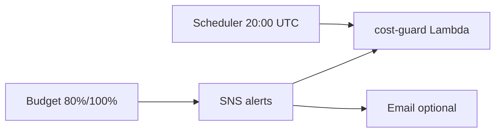

# Cẩm nang Kiến thức Toàn diện W6 — Phần 1: Cost Visibility & Cost Control

> **Phạm vi:** 100% kiến thức MH-COST-V và MH-COST-A trong đề W6 — gồm các path/pattern team có thể chọn, không chỉ implementation Kicks Shoes.  
> 👉 [Xem Phần 2: MH-OBS & MH-SEC](./w6_full_knowledge_part2.md)  
> 👉 **Mất gốc:** đọc [w6_foundations.md](./w6_foundations.md) trước khi đọc file này.

---

## Đọc file này khi nào?

| Bạn là… | Đọc gì trước |
|---------|--------------|
| Mới học AWS / chưa làm W5 | foundations → must_haves → **file này** (ôn) |
| Đã deploy W6, cần làm evidence | must_haves part 1–2 |
| Mentor hỏi “còn path nào khác?” | **file này** (mọi path) |

---

## MH-COST-V — Cost Visibility & Attribution

### 📚 Định nghĩa tổng quan

**FinOps (Financial Operations)** trên cloud = kết hợp kỹ thuật + tài chính để:
1. **Allocate** — gán chi phí đúng team/app
2. **Monitor** — theo dõi xu hướng
3. **Optimize** — giảm lãng phí
4. **Govern** — policy, budget, guardrails

W6 MH-COST-V tập trung bước **Allocate + Monitor**.

> **Cho người mới:** *Allocate* = gắn nhãn để biết tiền của team/app nào. *Monitor* = xem biểu đồ + còi báo — **không** tự tắt máy (đó là COST-A).

### 📚 Bảng thuật ngữ (có ví von)

| Thuật ngữ | Định nghĩa | Ví von |
| :--- | :--- | :--- |
| **Blended Cost** | Chi phí sau discount RI/SP — số hay xem nhất | Giá sau voucher |
| **Unblended Cost** | Giá list trước discount | Giá gốc trên bảng |
| **Cost Allocation Tag** | Tag user activate để chia bill | Nhãn trên sao kê |
| **AWS-generated tag** | Tag AWS tự gán — activate riêng | Mã vạch do AWS in |
| **Cost Category** | Rule gom tag phức tạp | “Nhóm khách VIP” |
| **CUR** | Bill chi tiết nhất → S3/Athena | Excel gốc từng dòng |
| **Budget** | Cảnh báo ngưỡng — **không** khóa account | Còi báo, không cắt điện |

### 🛤️ Path A — Tagging Strategy (Team Kicks Shoes chọn)

#### Yêu cầu đề bài

| Tag Key | Rule |
|---------|------|
| `Owner` | Email owner, lowercase nhất quán |
| `Environment` | `dev` only trong workshop |
| `CostCenter` | `G13` (group ID) |
| `Application` | `KicksShoes` — không `kicks-shoes`, `Kicks Shoes` |

#### Terraform pattern

```hcl
# variables.tf — default tags
variable "tags" {
  type = map(string)
  default = {
    Owner       = "team-lead@email.com"
    CostCenter  = "G13"
    Application = "KicksShoes"
  }
}

# Mọi resource: tags = local.common_tags
locals {
  common_tags = merge(var.tags, {
    Project     = "kicks-shoes"
    Environment = "dev"
    ManagedBy   = "terraform"
  })
}
```

#### Activate tags (console only)

```
Billing → Cost allocation tags → User-defined tags → Activate Owner, Application, CostCenter
```

**Latency:** 24h đến 48h trước khi Cost Explorer group-by tag có data đầy đủ.

### 🛤️ Path B — Cost Explorer + Saved Report

1. **Cost Explorer** → Create report
2. Granularity: Daily
3. Group by: Service
4. Filter: Tag `Application = KicksShoes`
5. Save report → screenshot cho evidence

**Top cost drivers thường gặp (Kicks Shoes):**

| Service | Lý do đắt |
|---------|-----------|
| Amazon VPC (NAT Gateway) | NAT hourly + data processing |
| Network Firewall | ~$0.395/h per endpoint × AZ |
| ECS Fargate | Task vCPU/memory giờ chạy |
| ElastiCache | `cache.t3.micro` 24/7 |
| CloudFront | Data transfer out |

### 🛤️ Path C — Cost Anomaly Detection (khuyến nghị đề)

```hcl
# Có thể thêm Terraform (tùy provider version)
resource "aws_ce_anomaly_monitor" "kicks_shoes" {
  name              = "${var.project_name}-anomaly-monitor"
  monitor_type      = "DIMENSIONAL"
  monitor_dimension = "SERVICE"
}

resource "aws_ce_anomaly_subscription" "kicks_shoes" {
  name      = "${var.project_name}-anomaly-alerts"
  frequency = "DAILY"
  monitor_arn_list = [aws_ce_anomaly_monitor.kicks_shoes.arn]
  subscriber {
    type    = "SNS"
    address = aws_sns_topic.alerts.arn
  }
  threshold_expression {
    dimension { key = "APPLICATION" values = ["KicksShoes"] }
  }
}
```

> Workshop có thể làm thủ công: **Cost Anomaly Detection** → Create monitor → SERVICE dimension → SNS alerts.

---

## MH-COST-A — Cost Control & Action

### 📚 Định nghĩa

**Cost Control** = automated response khi chi phí hoặc schedule đạt điều kiện.

Khác Budget thuần:
- Budget → chỉ **notify**
- Cost Guard → **stop/terminate** resources

### 🛤️ Path A — Lambda Stop/Start (Team chọn)

#### Khi nào chọn?

- Workshop account `dev` only
- Có EC2/RDS demo hoặc muốn chứng minh action
- Chấp nhận **stop** (không terminate) để preserve data

#### IAM least privilege

```json
{
  "Statement": [
    {
      "Sid": "StopEC2",
      "Effect": "Allow",
      "Action": ["ec2:DescribeInstances", "ec2:StopInstances"],
      "Resource": "*"
    },
    {
      "Sid": "StopRDS",
      "Effect": "Allow",
      "Action": ["rds:DescribeDBInstances", "rds:StopDBInstance", "rds:ListTagsForResource"],
      "Resource": "*"
    }
  ]
}
```

> **Không** grant `TerminateInstances` trong workshop — rủi ro mất data vĩnh viễn.

#### Tag convention `keep=true`

| Tag | Ý nghĩa |
|-----|---------|
| `Environment=dev` | Target cho cost-guard |
| `keep=true` | Miễn stop (bastion, long-running demo) |

#### Triggers

| Trigger | Cấu hình Kicks Shoes |
|---------|---------------------|
| Schedule | EventBridge Scheduler `cron(0 20 * * ? *)` |
| Budget SNS | `aws_sns_topic_subscription` protocol `lambda` |
| Manual | `aws lambda invoke` cho demo |

#### Budget → SNS → Lambda chain



**ADR template — Cost data latency:**

> AWS Budgets Actual cost có latency 8–24h. Trong sprint 48h, cost-driven SNS alert có thể không fire trước deadline. Giải pháp evidence: (1) Terraform wire đầy đủ, (2) `aws sns publish` test invoke Lambda, (3) scheduled stop demo với EC2 test + CloudTrail.

### 🛤️ Path B — Instance Scheduler (AWS Solution / SOC)

- Dùng **Instance Scheduler on AWS** (CloudFormation solution)
- UI schedule start/stop theo tag
- Phù hợp enterprise nhiều account — **nặng hơn** Lambda tự viết cho workshop

### 🛤️ Path C — Auto Scaling scale-to-zero (ECS only)

- ECS Service `desired_count = 0` ngoài giờ — tiết kiệm Fargate
- **Không** stop NAT/Firewall — cost-guard Lambda không đủ cho network tier
- Kicks Shoes giữ `desired_count = 1` cho demo E2E ổn định

### 🛤️ Path D — AWS Organizations SCP (không dùng workshop)

- Service Control Policy chặn launch instance type lớn
- Cấp account level — ngoài phạm vi single dev account

---

## So sánh Budget: Daily vs Monthly

| | Đề workshop ghi | Kicks Shoes TF |
|--|-------------------|----------------|
| Time unit | Daily $150 (một số doc) | **MONTHLY** $150 |
| Ý nghĩa | Cap từng ngày | Cap cả tháng workshop |
| Evidence | Cả hai acceptable nếu giải thích trong ADR | |

---

## Verify checklist (exam-style)

1. **Tags:** 4 keys trên ECS, Lambda, S3, Firewall — Console Tag Editor
2. **Budget:** `describe-budget` → limit 150 USD
3. **Lambda:** cost-guard Active, last modified recent
4. **Scheduler:** cron expression đúng timezone UTC
5. **SNS sub:** endpoint = Lambda ARN
6. **CloudTrail:** `StopInstances` sau demo
7. **Cost Explorer:** filter Application sau activate tags

---

## Câu hỏi ôn tập (Part 1) — Gợi ý đáp án

| Câu hỏi | Trả lời ngắn |
|---------|--------------|
| Tag vs Cost allocation tag? | Tag gắn resource; allocation tag = tag đã activate để chia bill |
| Budget có tắt ECS không? | Không — chỉ SNS; cost-guard không stop Fargate |
| Vì sao 2 trigger cost-guard? | Schedule = tiết kiệm đêm; SNS = phản ứng bill cao |
| `keep=true` để làm gì? | Miễn stop instance demo quan trọng |
| Monthly vs Daily $150? | Repo dùng monthly; giải thích trong ADR nếu đề ghi daily |

---

> 👉 [Phần 2: MH-OBS paths, MH-SEC paths, KMS, Detect-Fix patterns](./w6_full_knowledge_part2.md)  
> 👉 Thực hành: [w6_must_haves_mapping.md](./w6_must_haves_mapping.md)
