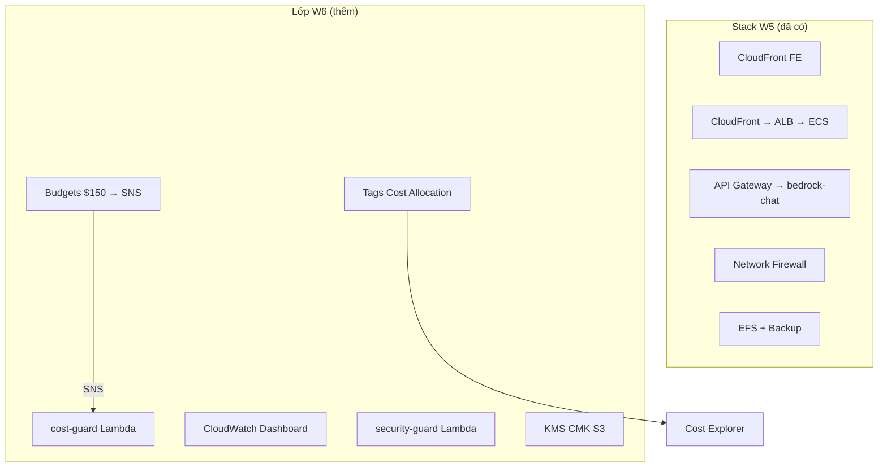
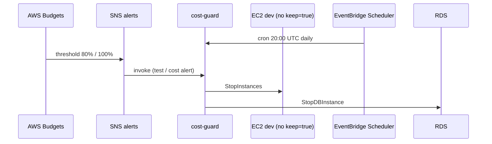

# Cẩm nang AWS Tuần 6 — Phần 1: Thuật ngữ, MH-COST-V & MH-COST-A

> Tài liệu chia làm 2 phần. Phần 1: **Bảng Thuật Ngữ**, nền tảng W6, **MH-COST-V** (Cost Visibility) và **MH-COST-A** (Cost Control).  
> 👉 [Xem Phần 2: MH-OBS, MH-SEC & Evidence](./w6_must_haves_part2.md)

> [!TIP] **Mất gốc?** Đọc trước [w6_foundations.md](./w6_foundations.md) (30–45 phút) — giải thích AWS billing, EC2 vs Lambda, 4 MH bằng ngôn ngữ đời thường.

---

## 📖 Bảng Định Nghĩa Thuật Ngữ AWS (Glossary W6)

> Cột **Ví von** giúp nhớ lâu; cột **Ví dụ** giúp tìm trên Console/CLI.

| Thuật ngữ | Định nghĩa dễ hiểu | Ví von | Ví dụ trong dự án |
| :--- | :--- | :--- | :--- |
| **Tag** | Cặp `Key=Value` dán lên mọi AWS resource để tìm & chia bill | Nhãn hành lý trên vali | `Environment=dev` |
| **Cost Allocation Tag** | Tag dùng **chia hóa đơn** trong Cost Explorer. Phải **Activate** trên Billing (chờ ~24h). | Bật “tính tiền theo nhãn” trên sao kê | `Owner`, `Application`, `CostCenter` |
| **AWS Budgets** | Cảnh báo khi chi phí **vượt ngưỡng** ($ hoặc %). Gửi SNS — **không** tự tắt máy (trừ khi nối SNS → Lambda). | Còi báo 80% hạn mức điện | `kicks-shoes-dev-tientp-monthly-150-cap` |
| **Cost Anomaly Detection** | ML phát hiện bill **bất thường** (vd tăng đột biến NAT). | Bảo vệ gia tăng bất ngờ | *(tùy chọn)* |
| **Cost Guard Lambda** | Robot **stop EC2/RDS** dev (không tag `keep=true`). **Không** stop ECS. | Timer tắt máy phòng lab | `kicks-shoes-dev-tientp-cost-guard` |
| **EventBridge Scheduler** | Hẹn giờ gọi Lambda (cron), không cần server bật 24/7. | Báo thức 20:00 | `cron(0 20 * * ? *)` |
| **SNS Topic** | Kênh phát tin — Budget, alarm, test đều có thể gửi vào đây. | Nhóm chat thông báo | `...-alerts` |
| **CloudTrail** | Sổ audit: **ai** gọi API AWS **lúc nào** (StopInstances, PutPublicAccessBlock). | Camera cửa API | Event history |
| **StopInstances** | Tắt EC2 — **giữ disk**, bật lại được, vẫn mất phí disk. | Tắt máy, không bán phế liệu | Demo MH-COST-A |
| **TerminateInstances** | Xóa hẳn EC2 — **mất data**. cost-guard **không** dùng. | Bán phế liệu | ❌ không dùng |
| **Custom Metric** | Số liệu app tự gửi (`PutMetricData`), vd latency Bedrock. | Đồng hồ đo tự lắp | `BedrockQueryLatencyMs` |
| **CloudWatch Dashboard** | Một trang gom nhiều biểu đồ. | Bảng điều khiển xe | `...-operations` |
| **INSUFFICIENT_DATA** | Alarm chưa đủ số đo → mentor **không** chấp nhận Friday. | Nhiệt kế chưa cắm pin | Xem foundations §10 |
| **Security Guard Lambda** | Robot S3: phát hiện public → khóa lại 4 BPA. | Khóa kho tự động | `...-security-guard` |
| **KMS CMK** | Chìa khóa mã hóa bạn sở hữu — audit được trên CloudTrail. | Két sắt riêng có sổ | `alias/...-s3-uploads` |
| **Block Public Access (BPA)** | 4 nút khóa S3 không cho internet đọc bucket. | 4 ổ khóa cửa kho | Uploads bucket |

---

## 0. Nền tảng: W6 trên stack W5 (Carry-forward)

> [!IMPORTANT]
> W6 **không rebuild** VPC, Firewall, API Gateway, EFS. W6 **bổ sung lớp vận hành** lên stack đã có.



### Kiến trúc chi phí (luồng MH-COST-A)



---

## 1. MH-COST-V — Cost Visibility & Attribution (Biết tiền đi đâu)

### 📚 Định nghĩa (cho người mới)

**Cost Visibility** = nhìn được hóa đơn cloud như sao kê thẻ:

| Câu hỏi | Trả lời bằng công cụ nào |
|---------|--------------------------|
| Tháng này đốt bao nhiêu? | Cost Explorer, Budget Actual |
| Service nào đắt nhất? | Cost Explorer → Group by **Service** |
| Team/app nào trả tiền? | Tag `Application`, `CostCenter` (sau Activate) |
| Sắp vượt $150? | Budget alert 80% / 100% → SNS |

**Hai bước tách biệt (hay nhầm):**
1. **Gắn tag** (Terraform) — dán nhãn lên resource.
2. **Activate tag** (Console, 1 lần) — bảo AWS “hãy dùng nhãn này để chia bill”.

### 🎯 Mục đích

| Vấn đề trước W6 | Sau W6 |
|-----------------|--------|
| Tags chỉ `Project`, `Environment`, `ManagedBy` | Thêm `Owner`, `CostCenter`, `Application` |
| Cost Explorer không filter theo app | Activate allocation tags → filter `Application=KicksShoes` |
| Không có ngưỡng cảnh báo | Budget $150/month → SNS |

### 💻 Code Terraform — Tags (giải thích từng khối)

**Bước 1 — Khai báo tag mặc định**  
File: `infra/terraform/environments/dev/02-app/variables.tf`

```hcl
variable "tags" {
  type = map(string)
  default = {
    Owner       = "team-lead@kicks-shoes.com"  # Ai chịu trách nhiệm bill
    CostCenter  = "G13"                         # Mã nhóm workshop
    Application = "KicksShoes"                  # Tên app — viết đúng chữ hoa
  }
}
```

**Bước 2 — Trộn tag chung cho mọi resource**  
File: `infra/terraform/environments/dev/02-app/main.tf`

```hcl
locals {
  common_tags = merge(var.tags, {           # merge = gộp map
    Project     = "kicks-shoes"
    Environment = "dev"                     # Bắt buộc đúng chữ thường "dev"
    ManagedBy   = "terraform"
  })
}
# Mỗi resource: tags = local.common_tags
```

**Bước 3 — Override cá nhân (optional)**  
File: `terraform.tfvars`

```hcl
tags = { Owner = "tientp" }
# CostCenter + Application vẫn lấy default — không cần ghi lại
```

**Sau `terraform apply`:** Vào ECS → Tags → phải thấy đủ 4 key mentor yêu cầu.

### 💻 Code Terraform — AWS Budgets

**File:** `infra/terraform/environments/dev/02-app/budgets.tf`

```hcl
resource "aws_budgets_budget" "monthly_cost_cap" {
  name         = "${var.project_name}-monthly-150-cap"
  budget_type  = "COST"
  limit_amount = "150"
  limit_unit   = "USD"
  time_unit    = "MONTHLY"   # Workshop doc ghi daily — team dùng MONTHLY cap $150

  notification {
    comparison_operator       = "GREATER_THAN"
    threshold                 = 80
    threshold_type            = "PERCENTAGE"
    notification_type         = "ACTUAL"
    subscriber_sns_topic_arns = [aws_sns_topic.alerts.arn]
  }
  # notification 100% tương tự
}
```

> [!WARNING]
> **Activate cost allocation tags** không làm được bằng Terraform. Bắt buộc thủ công:
> 1. **Billing** → **Cost allocation tags**
> 2. Tìm `Owner`, `Application`, `CostCenter` → **Activate**
> 3. Đợi **~24 giờ** mới có data trong Cost Explorer

### 🖥️ Cách xem trên AWS Console

1. **Resource Groups and Tag Editor** → Tìm ECS service / Lambda → Tab **Tags** → 4 keys: `Owner`, `Environment`, `CostCenter`, `Application`.
2. **Billing** → **Budgets** → `kicks-shoes-dev-tientp-monthly-150-cap` → xem Actual vs Budgeted.
3. **Cost Explorer** → Group by **Service** → Filter tag `Application = KicksShoes` (sau khi activate).

### ✅ Verify CLI

```powershell
# Budget tồn tại
aws budgets describe-budget --account-id 962533717758 `
  --budget-name kicks-shoes-dev-tientp-monthly-150-cap

# Chi phí tháng hiện tại (ước lượng)
aws ce get-cost-and-usage `
  --time-period Start=2026-05-01,End=2026-05-21 `
  --granularity MONTHLY --metrics BlendedCost
```

### 📋 Checklist MH-COST-V

- [ ] `terraform apply` — tags xuất hiện trên ECS, Lambda, S3, Firewall
- [ ] Activate allocation tags trên Billing Console
- [ ] Screenshot Cost Explorer (top 3 cost drivers)
- [ ] Viết 1 đoạn observation (NAT, Firewall endpoint, ECS thường đắt nhất)

---

## 2. MH-COST-A — Cost Control & Action (Tự động cắt chi phí)

### 📚 Định nghĩa (cho người mới)

**Cost Control** = sau khi **biết** tiền (COST-V), hệ thống **tự làm gì đó** để giảm bill:

| Hành động | Ai làm | Khi nào |
|-----------|--------|---------|
| Gửi cảnh báo | AWS Budgets → SNS | Vượt 80% / 100% ngưỡng $150 |
| Stop EC2/RDS | cost-guard Lambda | 20:00 UTC mỗi ngày **hoặc** khi SNS kích hoạt |
| Stop ECS/Fargate | ❌ **Không** (code không có) | Muốn tiết kiệm ECS → scale count (khác scope) |

### 🎯 Logic cost-guard (đọc như flowchart)

```
Bắt đầu
  → Liệt kê EC2 đang "running"
  → Có tag Environment=dev?
       Không → bỏ qua
       Có → có tag keep=true?
            Có → bỏ qua (miễn trừ)
            Không → StopInstances
  → Lặp tương tự cho RDS status "available"
  → Ghi log + return danh sách đã stop
```

| Resource | Điều kiện STOP | Không stop khi |
|----------|----------------|----------------|
| EC2 | `running` + `Environment=dev` | `keep=true` |
| RDS | `available` + `Environment=dev` | `keep=true` |

**Ví dụ:** EC2 lab `Environment=dev` không `keep` → bị stop lúc 20:00 UTC. ECS backend **không** có tag EC2 → **không** bị cost-guard tắt.

### 💻 Lambda Code

**File:** `backend/lambda/cost-guard/index.py`

- Trigger 1: EventBridge Scheduler `cron(0 20 * * ? *)`
- Trigger 2: SNS từ Budgets (cùng topic `alerts`)

Build zip trước `terraform apply`:

```powershell
Compress-Archive -Path backend/lambda/cost-guard/index.py `
  -DestinationPath backend/lambda/cost-guard/cost-guard.zip -Force
```

### 💻 Terraform — cost-guard.tf (tóm tắt)

| Resource | Vai trò |
|----------|---------|
| `aws_lambda_function.cost_guard` | Python 3.12, zip từ repo |
| `aws_scheduler_schedule.cost_guard_daily` | 20:00 UTC |
| `aws_sns_topic_subscription.budgets_to_cost_guard` | SNS → Lambda |
| `aws_iam_role_policy.cost_guard_actions` | `ec2:StopInstances`, `rds:StopDBInstance` |

> [!NOTE]
> Đường dẫn zip từ `02-app`: **`../../../../../backend/lambda/...`** (5 cấp lên repo root), không phải 4 cấp.

### 🖥️ Demo bắt buộc (Evidence)

**Bước 1 — Tạo EC2 test:**

```powershell
aws ec2 run-instances `
  --image-id resolve:ssm:/aws/service/ami-amazon-linux-latest/al2023-ami-kernel-default-x86_64 `
  --instance-type t3.micro `
  --tag-specifications "ResourceType=instance,Tags=[{Key=Environment,Value=dev},{Key=Name,Value=w6-cost-guard-demo}]" `
  --region us-east-1
```

**Bước 2 — Invoke Lambda:**

```powershell
aws lambda invoke --function-name kicks-shoes-dev-tientp-cost-guard `
  --payload '{"source":"manual-demo"}' --region us-east-1 out.json
Get-Content out.json
```

**Bước 3 — CloudTrail:** Event history → filter `StopInstances` → screenshot.

**Bước 4 — Test SNS chain:**

```powershell
$topic = aws sns list-topics --query "Topics[?contains(TopicArn,'alerts')].TopicArn" --output text
aws sns publish --topic-arn $topic --message "W6 budget test" --region us-east-1
```

### 📋 ADR — Cost data latency (viết ngắn)

Budget dùng **Actual cost** có độ trễ **8–24 giờ**. Trong workshop 48h, alert cost-driven có thể **không kịp fire** — chấp nhận được nếu:
- Wire SNS → Lambda đã có (Terraform)
- Test bằng SNS publish thủ công
- Ghi ADR giải thích latency

### ✅ Verify đã deploy

```powershell
aws lambda get-function --function-name kicks-shoes-dev-tientp-cost-guard --region us-east-1
aws scheduler get-schedule --name kicks-shoes-dev-tientp-cost-guard-daily --group-name default --region us-east-1
```

### 📋 Checklist MH-COST-A

- [ ] Lambda + Scheduler + SNS subscription Active
- [ ] Demo stop EC2 → CloudTrail evidence
- [ ] Test SNS → Lambda invoke thành công
- [ ] ADR cost-data latency (1 đoạn trong evidence pack)

---

> 👉 **Tiếp tục Phần 2:** [MH-OBS, MH-SEC, Evidence Pack & URL deploy](./w6_must_haves_part2.md)
