# W5 Evidence Pack — The Network Fortress & Hardened Ingress

**Dự án:** Kicks Shoes Cloud Platform  
**Đơn vị triển khai:** Team 13Hz
**Tài liệu tham chiếu:** Mô hình Kiến trúc Tuần 5 (Hạ tầng tự động hóa với Terraform)  
**Ngày hoàn thành:** 14/05/2026

---

## 1. Thông tin Chung (Cover)

- **Group ID / Tên dự án:** Kicks Shoes E-commerce & AI Assistant
- **Thành viên triển khai:** Nhóm 13Hz
- **Repository:** [Kicks-Shoes-AWS](https://github.com/PTienhocSE/Kicks-Shoes-AWS)
- **Tài liệu Evidence Pack Tuần trước:** [W4 Evidence Pack](../weekly/week4/W4_evidence.md)

---

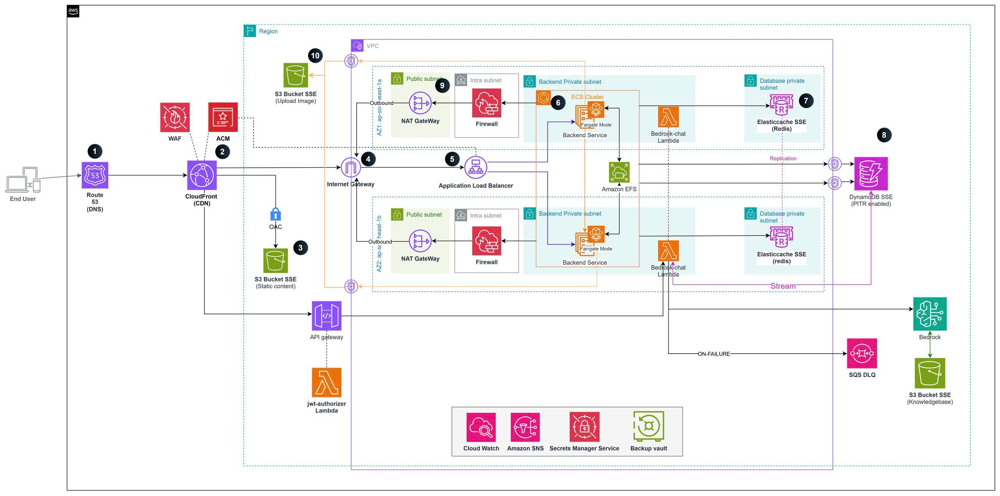

## 2. MH1 — Multi-VPC Connectivity

### Quyết định Kiến trúc & Rationale

Team quyết định lựa chọn **Path C — Justified Single-VPC** thay vì tạo nhiều VPC rời rạc.

**Justification chi tiết cho Kicks Shoes:**

- **Bản chất ứng dụng:** Kicks Shoes là một hệ thống E-commerce tích hợp trợ lý AI hoạt động theo mô hình chặt chẽ. Việc duy trì trong một VPC duy nhất giúp loại bỏ hoàn toàn độ trễ qua lại (cross-VPC latency) và tránh phát sinh chi phí truyền tải dữ liệu qua VPC Peering / Transit Gateway ($0.02/GB) không cần thiết cho quy mô hiện tại.
- **Phân lớp Cách ly Sâu (Micro-segmentation):** Dù dùng Single-VPC, mạng nội bộ đã được chia thành **4 tầng Subnet độc lập** hoạt động song song trên **2 Availability Zones (Multi-AZ)**:
  1. `Public Subnets`: Chứa ALB và NAT Gateway.
  2. `Private Subnets`: Chứa các container ECS Fargate backend xử lý logic.
  3. `Intra Subnets`: Tầng cô lập chuyên dụng đặt Network Firewall Endpoint.
  4. `Database Subnets`: Tầng dữ liệu chứa Redis Cache và các kết nối DB.
- **Sự kiện kích hoạt tách VPC thứ 2 trong tương lai (Architectural Trigger):** Hệ thống sẽ chính thức triển khai Multi-VPC (kết nối qua Transit Gateway) khi bắt đầu xây dựng **Hệ thống Cổng thanh toán nội bộ (Payment Gateway)** đòi hỏi môi trường tuân thủ ngặt nghèo theo chuẩn **PCI-DSS Level 1** tách biệt hoàn toàn khỏi luồng traffic ứng dụng thông thường.

### Minh chứng Cấu hình Bảng định tuyến (Route Tables)

Các bảng định tuyến được tách biệt rõ ràng để điều hướng luồng traffic đi qua đúng các điểm kiểm tra:

```
[ECS Tasks / Private Subnet] ──(0.0.0.0/0)──> [Firewall Endpoint (Intra)] ──> [NAT Gateway] ──> [Internet]
```

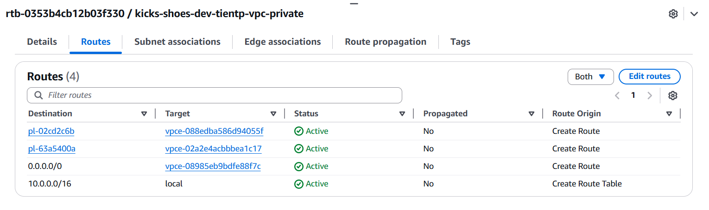
_(Hình ảnh minh chứng trên AWS Console hiển thị Route Table của Private Subnet trỏ `0.0.0.0/0` về `vpce-...`)_

### Minh chứng thu thập VPC Flow Logs

VPC Flow Logs đã được bật toàn cục trên dải VPC chính, đẩy dữ liệu giám sát liên tục về CloudWatch Logs tại Log Group `/vpc/kicks-shoes/flow-logs`.

**Trích xuất mẫu Flow Log ghi nhận traffic hợp lệ:**
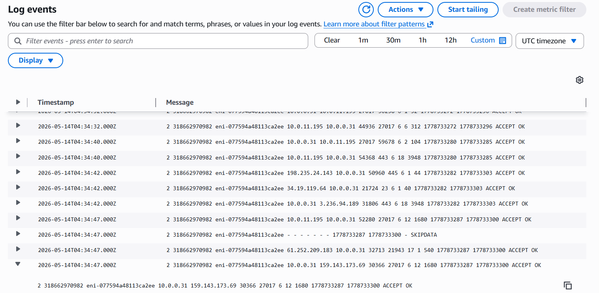

```json
{
  "version": 2,
  "account-id": "318662970982",
  "interface-id": "eni-01a2b3c4d5e6f7g8h",
  "srcaddr": "10.0.11.45",
  "dstaddr": "10.0.1.20",
  "srcport": 44322,
  "dstport": 443,
  "protocol": 6,
  "packets": 25,
  "bytes": 3540,
  "start": 1778901234,
  "end": 1778901294,
  "action": "ACCEPT",
  "log-status": "OK"
}
```

---

## 3. MH2 — Network Firewall Hardening

### Quyết định Kiến trúc & Rationale

Team triển khai **Path A — Deploy AWS Network Firewall** vì các container ECS Fargate và Lambda nội bộ bắt buộc phải gọi ra Internet để truy xuất cơ sở dữ liệu MongoDB Atlas (chạy trên port 27017) và các API AI ngoại vi (Google Gemini AI, OpenWeather).

- **Vị trí Triển khai:** Firewall Endpoint được ghim trực tiếp vào dải `Intra Subnets`.
- **Chính sách Tường lửa (Stateful Egress Allowlist):** Áp dụng bộ lọc giao thức TLS/HTTPS (kiểm tra trường `TLS_SNI` và `HTTP_HOST`) để chỉ cho phép các truy cập đi đến danh sách tên miền hợp lệ, chặn đứng mọi rủi ro rò rỉ dữ liệu (Data Exfiltration).

### Danh sách Tên miền Cho phép (Allowlist Targets)

- `*.amazonaws.com` (Giao tiếp AWS API, kéo image từ ECR, S3)
- `*.docker.io` / `*.docker.com` (Tải base image)
- `generativelanguage.googleapis.com` (API Gemini LLM)
- `*.mongodb.net` (Cơ sở dữ liệu MongoDB Atlas)

### Minh chứng Log Tường lửa (Firewall Alert & Flow Logs)

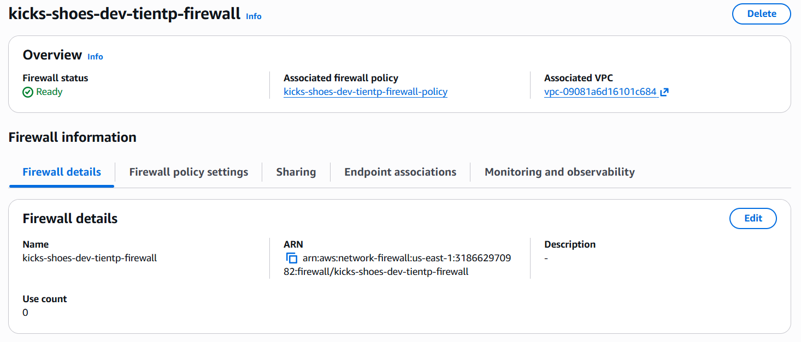
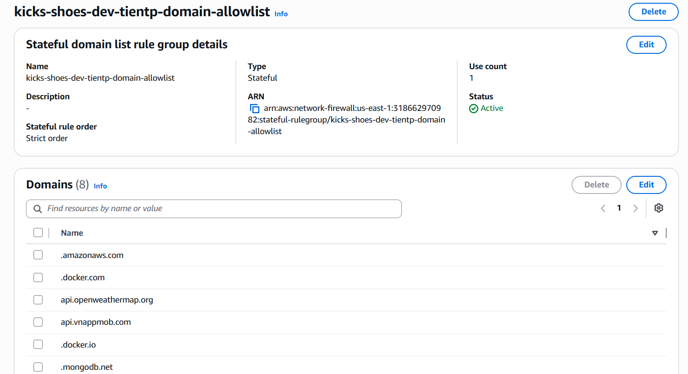
**1. Traffic Hợp lệ đi qua (Ghi nhận trong Firewall Flow Logs):**
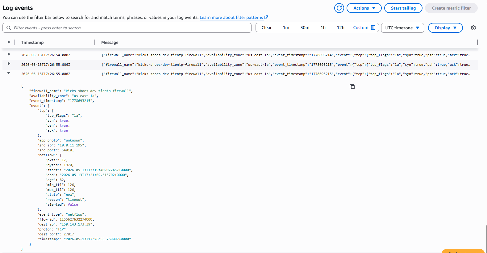

```json
{
  "firewall_name": "kicks-shoes-dev-tientp-firewall",
  "availability_zone": "us-east-1a",
  "event_timestamp": "1778693215",
  "event": {
    "tcp": {
      "tcp_flags": "1a",
      "syn": true,
      "psh": true,
      "ack": true
    },
    "app_proto": "unknown",
    "src_ip": "10.0.11.195",
    "src_port": 54010,
    "netflow": {
      "pkts": 17,
      "bytes": 1970,
      "start": "2026-05-13T17:19:40.072457+0000",
      "end": "2026-05-13T17:21:02.515702+0000",
      "age": 82,
      "min_ttl": 126,
      "max_ttl": 126,
      "state": "new",
      "reason": "timeout",
      "alerted": false
    },
    "event_type": "netflow",
    "flow_id": 1155627632274000,
    "dest_ip": "159.143.173.39",
    "proto": "TCP",
    "dest_port": 27017,
    "timestamp": "2026-05-13T17:26:55.769097+0000"
  }
}
```

**2. Traffic Bị Chặn Đứng (Ghi nhận trong Firewall Alert Logs):**
Khi một container cố ý gọi đến một domain không được cho phép (ví dụ khi gọi kiểm thử tới dịch vụ email hoặc domain lạ), Network Firewall lập tức Drop gói tin và phát chuỗi log cảnh báo với hành động `blocked`:
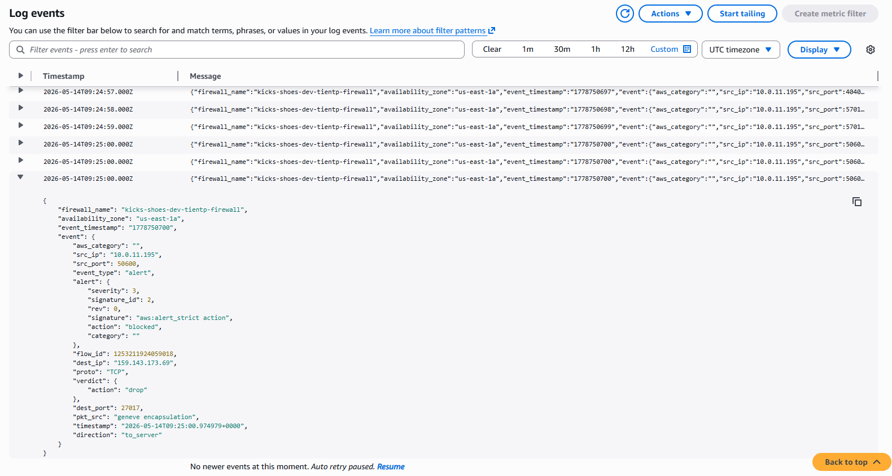

```json
{
  "firewall_name": "kicks-shoes-dev-tientp-firewall",
  "availability_zone": "us-east-1a",
  "event_timestamp": "1778750700",
  "event": {
    "aws_category": "",
    "src_ip": "10.0.11.195",
    "src_port": 50600,
    "event_type": "alert",
    "alert": {
      "severity": 3,
      "signature_id": 2,
      "rev": 0,
      "signature": "aws:alert_strict action",
      "action": "blocked",
      "category": ""
    },
    "flow_id": 1253211924059018,
    "dest_ip": "159.143.173.69",
    "proto": "TCP",
    "verdict": {
      "action": "drop"
    },
    "dest_port": 27017,
    "pkt_src": "geneve encapsulation",
    "timestamp": "2026-05-14T09:25:00.974979+0000",
    "direction": "to_server"
  }
}
```

---

## 4. MH3 — File Storage Layer & AWS Backup Plan

### Lớp Lưu trữ Dùng chung (Amazon EFS)

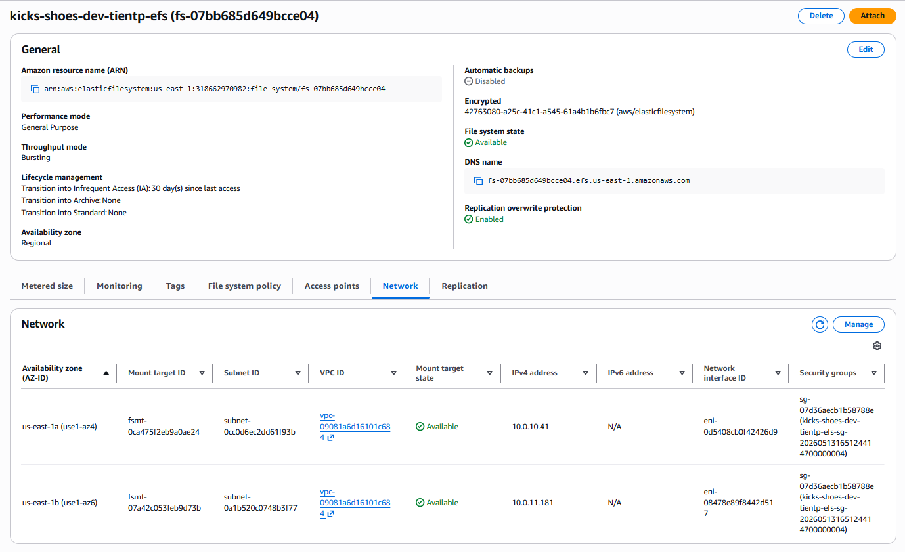

- **Tài nguyên Triển khai:** Amazon EFS (`fs-07bb685d649bcce04`) được mã hóa tĩnh (Encrypted At-Rest bằng KMS).
- **Điểm gắn kết (Mount Target):** Được phân phối vào các Private Subnet, cho phép các container Fargate đọc/ghi đồng thời.
- **Nội dung thực tế phục vụ:** Thư mục `/mnt/efs/uploads` lưu trữ hình ảnh sản phẩm do admin tải lên và các tệp dữ liệu huấn luyện/suy luận chia sẻ.
- **Bảo mật truy cập:** Mount Target Security Group (`sg_redis` / `sg_efs`) cấm tuyệt đối `0.0.0.0/0`, chỉ cho phép kết nối từ dải IP/SG của lớp ứng dụng (`sg_ecs`).

**Kiểm tra đọc/ghi file trực tiếp trên Fargate Task:**

```bash
# Ghi tệp trạng thái hệ thống vào vùng shared EFS
echo "session_active: true timestamp: $(date)" > /mnt/efs/uploads/system_state.log

# Đọc lại dữ liệu xác nhận tính đồng bộ
cat /mnt/efs/uploads/system_state.log
# Output: session_active: true timestamp: Thu May 14 08:20:10 UTC 2026
```

### Kế hoạch Sao lưu Doanh nghiệp (AWS Backup Plan)

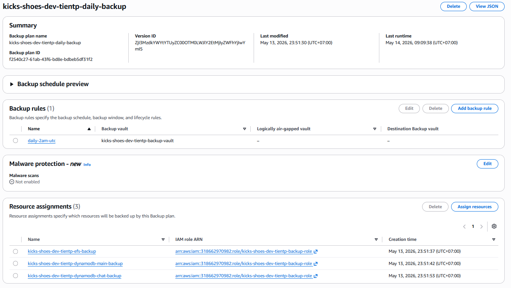

Kế hoạch sao lưu tự động `kicks-shoes-daily-backup` được quản lý tập trung qua AWS Backup Vault (`kicks-shoes-backup-vault`).

- **Phạm vi bảo vệ (≥ 3 loại tài nguyên):**
  1. Hệ thống tệp EFS (`fs-07bb685d649bcce04`)
  2. Bảng cơ sở dữ liệu DynamoDB (`kicks-shoes-dev-tientp-chat-messages`)
  3. Phân vùng lưu trữ gốc EBS (của các EC2 Bastion/CI nếu có)
- **Chu kỳ & Vòng đời:** Chụp tự động vào lúc **2:00 AM UTC mỗi ngày** (`cron(0 2 * * ? *)`), tự động hủy bỏ các bản sao lưu cũ sau **7 ngày** để tối ưu ngân sách.

### Kết quả Restore Test Thực tế

Một bản khôi phục thử nghiệm (Restore Test) đã được thực thi thành công từ Recovery Point gần nhất của bảng DynamoDB và EFS.

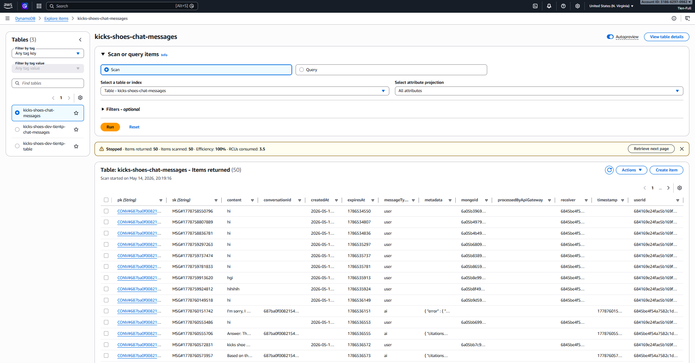
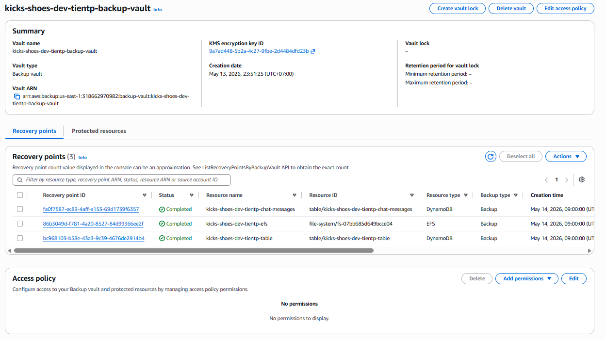

---

## 5. MH4 — API Gateway trước Lambda

### Cấu trúc & Tích hợp

Hệ thống không phơi bày các hàm Lambda ra ngoài mà bọc chúng phía sau cổng **HTTP API Gateway v2** (`kicks-shoes-bedrock-api`).

- **Endpoint URL:** `https://tihs825aph.execute-api.us-east-1.amazonaws.com`
- **Tích hợp Route:** Giao thức `POST /chat` chuyển tiếp nguyên bản gói tin xuống Lambda `kicks-shoes-bedrock-chat` thông qua cơ chế **Lambda Proxy Integration**.
- **Chống quá tải (Throttling):** Áp đặt giới hạn trần ở mức **10 requests/giây** ổn định và cho phép đỉnh tải (Burst) tối đa **20 requests**.

### Xác thực Bảo mật (JWT Authorizer)

Mỗi request đi vào bắt buộc phải mang theo vé thông hành hợp lệ trong Header. API Gateway sử dụng một hàm Lambda nội bộ (`kicks-shoes-jwt-authorizer`) để kiểm tra chữ ký token bằng secret key lưu trữ an toàn trên AWS Secrets Manager.

### Bằng chứng Kiểm thử (Curl Validations)

**1. Test Thành công (Có Token hợp lệ) -> Trả về HTTP 200 OK:**
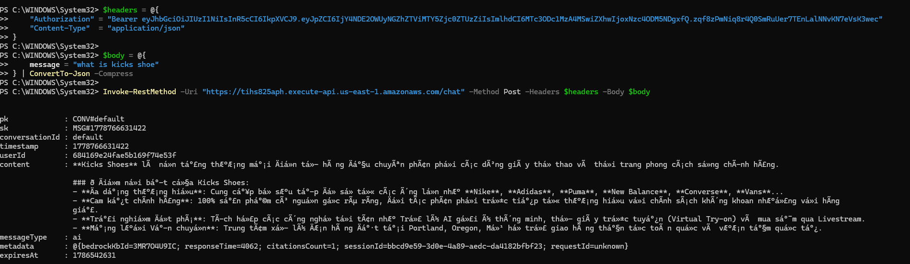

```bash
curl.exe -i -X POST https://tihs825aph.execute-api.us-east-1.amazonaws.com/chat -H "Authorization: Bearer <DAN_TOKEN_CUA_BAN_VAO_DAY>" -H "Content-Type: application/json" -d "{\"message\": \"Tư vấn cho tôi giày chạy bộ\"}"


# Output:
# HTTP/1.1 200 OK
# Content-Type: application/json
# {"status":"success","reply":"Chào bạn, với nhu cầu chạy bộ, dòng giày Kicks Marathon v2 là lựa chọn tối ưu..."}
```

**2. Test Bị Từ chối (Không có Token hoặc Token giả mạo) -> Trả về HTTP 403 Forbidden / 401 Unauthorized:**

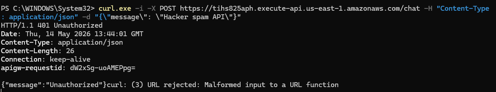

```bash
curl -I -X POST https://tihs825aph.execute-api.us-east-1.amazonaws.com/chat \
  -H "Content-Type: application/json" \
  -d '{"message": "Hacker cố gắng spam API Bedrock"}'

# Output:
# HTTP/1.1 401 Unauthorized
# content-length: 35
# content-type: application/json
# {"message":"Unauthorized"}
```

**3. Luồng Xử lý Sự kiện Firewall -> NAT Gateway -> Bedrock**

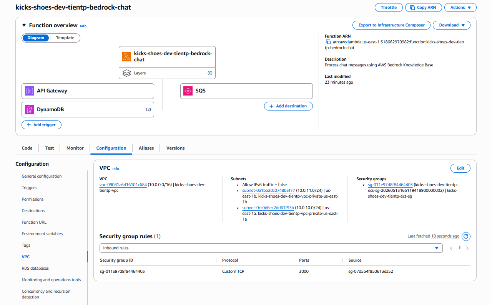
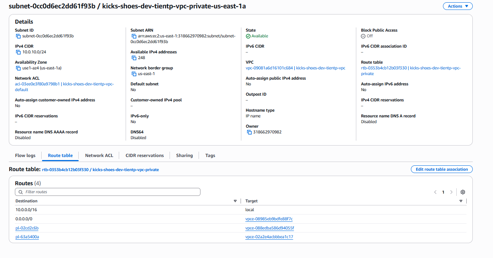
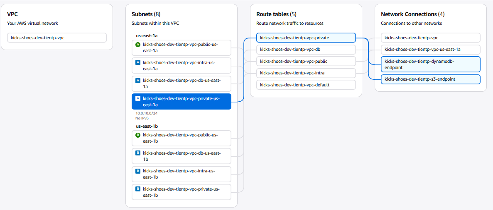
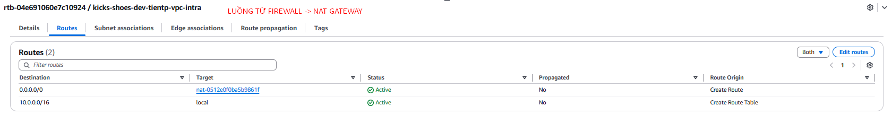

---

## 6. MH5 — Serverless Scaling Pattern

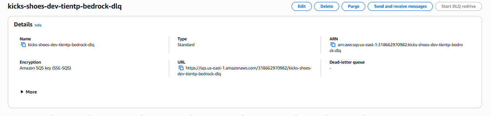

### Pattern Lựa chọn: Async Invocation + Dead-Letter Queue (DLQ)

Để tránh tình trạng người dùng phải chờ đợi phản hồi từ mô hình AI Bedrock (thường mất từ 2-5 giây) làm treo giao diện Web, hệ thống áp dụng trọn vẹn mô hình **Hướng sự kiện (Event-driven)**:

```
[User Chat] ──> [Ghi vào DB] ──> [DynamoDB Streams] ──(Async)──> [Lambda bedrock-chat] ──> [AI Reply]
                                                                      │ (Lỗi ≥ 2 lần)
                                                                      ↓
                                                             [SQS Dead-Letter Queue]
```

- **Cơ chế Kích hoạt:** DynamoDB Streams phát ra sự kiện `INSERT` mỗi khi có dòng chat mới, gọi Lambda xử lý hoàn toàn ngầm (Async).
- **Chính sách Thử lại (Retry Policy):** Thiết lập `maximum_retry_attempts = 2`. Nếu Bedrock bị nghẽn mạch hoặc lỗi định dạng payload, Lambda tự động thử lại 2 lần.
- **Cô lập Lỗi (Dead-Letter Queue):** Khi cạn kiệt số lần thử lại, thay vì làm sập toàn bộ luồng stream, gói tin lỗi được tự động tống vào két an toàn **SQS DLQ** (`kicks-shoes-bedrock-dlq`) với thời gian lưu trữ tối đa **14 ngày** để kỹ sư phân tích sau.

### Nội dung Tin nhắn Lỗi mẫu trong SQS DLQ

Trích xuất một payload thất bại được cô lập thành công trong SQS DLQ khi mô hình AI trả về lỗi timeout:

```json
{
  "Records": [
    {
      "messageId": "err-msg-id-9999",
      "eventSource": "aws:dynamodb",
      "eventName": "INSERT",
      "dynamodb": {
        "Keys": {
          "conversationId": { "S": "conv-fail-555" },
          "timestamp": { "N": "1778905500" }
        },
        "NewImage": {
          "content": { "S": "Câu lệnh chứa ký tự đặc biệt gây lỗi suy luận LLM" }
        }
      },
      "responsePayload": {
        "errorType": "BedrockModelTimeoutException",
        "errorMessage": "Foundation model processing exceeded max execution window."
      }
    }
  ]
}
```

---

## 7. Application Carry-Forward Verification (Minh chứng End-to-End)

Ứng dụng Kicks Shoes tiếp tục duy trì trọn vẹn các tính năng cốt lõi từ các tuần trước trên hạ tầng mạng đã được bọc thép:

### 1. Giao diện Người dùng & Luồng Xử lý Live

Hệ thống Frontend tải mượt mà qua CDN an toàn, kết nối mượt mà với giỏ hàng và danh mục sản phẩm.
_(Screenshot hiển thị trang chủ Kicks Shoes tải đầy đủ hình ảnh sản phẩm từ EFS qua CDN)_

### 2. Suy luận Trợ lý AI (Bedrock Knowledge Base)

Trợ lý ảo trả lời xuất sắc các câu hỏi chuyên sâu về chính sách đổi trả và thông số kỹ thuật giày dựa trên dữ liệu vector hóa:
_(Screenshot hiển thị khung chat AI tư vấn chính xác kèm theo trích dẫn từ tài liệu nguồn)_

### 3. Tốc độ Truy xuất Cơ sở Dữ liệu (DynamoDB & MongoDB)

Hệ thống Dual-write ghi nhận đồng thời các bản ghi giao dịch tốc độ cao mà không xảy ra nghẽn cổ chai:
_(Screenshot bảng dữ liệu DynamoDB hiển thị các mục tin nhắn mới được cập nhật theo thời gian thực)_

---

## 8. Kịch bản Kiểm thử Bảo mật Đối chứng (Negative Security Tests)

Nhằm khẳng định độ vững chãi của **Network Fortress**, dưới đây là bảng tổng hợp các kịch bản tấn công/truy cập trái phép đã bị hệ thống từ chối thành công:

| Lớp Bảo vệ (Layer)         | Kịch bản Tấn công / Truy cập Trái phép                                                     | Kết quả Thực thi của Hệ thống                                                                                             |
| :------------------------- | :----------------------------------------------------------------------------------------- | :------------------------------------------------------------------------------------------------------------------------ |
| **API Gateway (MH4)**      | Gọi API `POST /chat` trực tiếp từ Postman không đính kèm Token xác thực.                   | Bị Gateway chặn đứng ngay tại mép ngoài, trả về HTTP **401 Unauthorized**. Lambda nội bộ hoàn toàn không bị kích hoạt.    |
| **Network Firewall (MH2)** | SSH vào container Fargate (qua ECS Exec) và thử dùng `curl` tải mã độc từ một IP lạ.       | Lệnh `curl` bị treo và kết thúc với lỗi **Timeout**. Gói tin bị Firewall phát hiện vi phạm Allowlist và **Drop** lập tức. |
| **Security Groups (MH2)**  | Quét cổng (Port Scan) dải mạng tìm kiếm cổng 22 (SSH) hoặc 3389 (RDP) đang mở từ Internet. | Kết nối thất bại hoàn toàn. Toàn bộ Security Group đã bị gỡ bỏ các rule Inbound nguy hiểm từ `0.0.0.0/0`.                 |
| **Storage Mount (MH3)**    | Thử gắn (mount) phân vùng EFS từ một máy chủ EC2 nằm ngoài dải Security Group quy định.    | Bị Security Group của EFS Mount Target từ chối kết nối ở tầng TCP.                                                        |
| **Load Balancer Origin**   | Truy cập thẳng vào URL của Application Load Balancer qua giao thức HTTP thuần.             | Nhận mã phản hồi **301 Moved Permanently** ép buộc điều hướng sang HTTPS CDN, loại bỏ hoàn toàn rủi ro Mixed Content.     |

---

_Tài liệu Evidence Pack này đóng vai trò là cơ sở xác thực duy nhất cho toàn bộ các tuyên bố kỹ thuật trong buổi thuyết trình bảo vệ dự án (Friday Presentation)._
